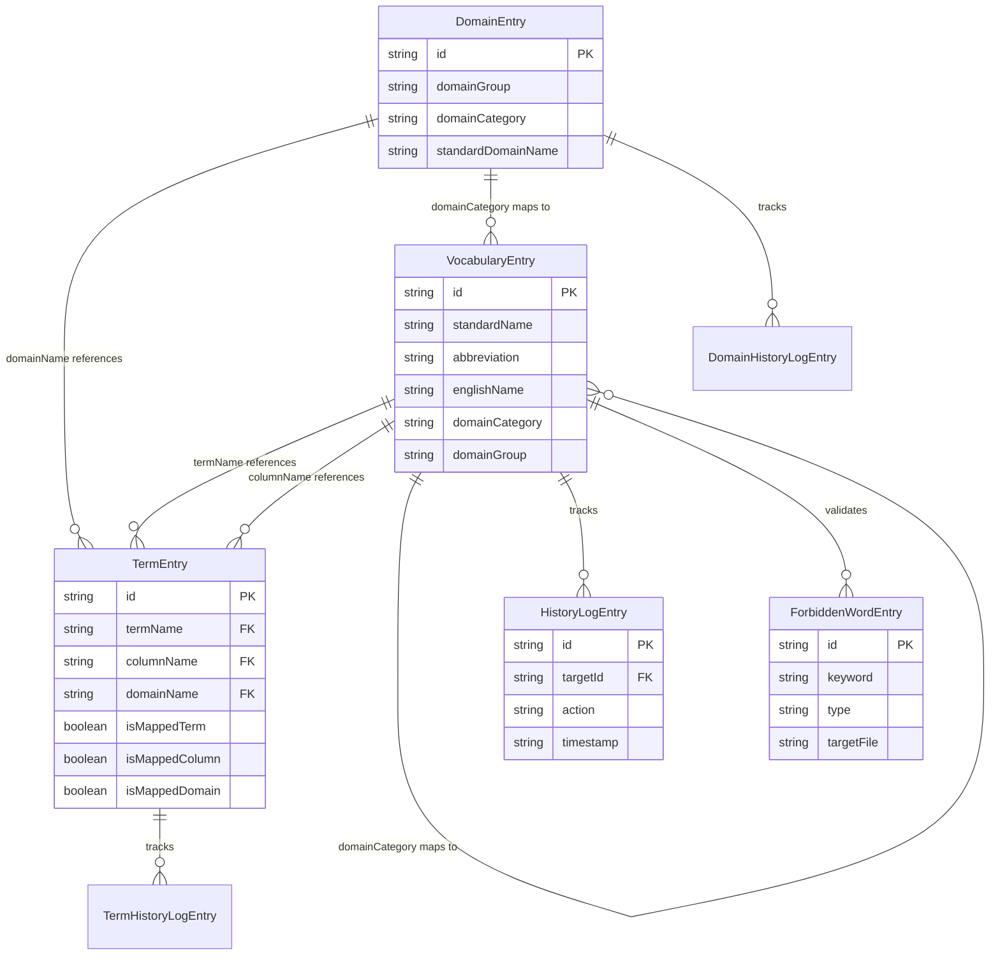

# 데이터 레이어 분석

## 개요

이 문서는 DbManager 프로젝트의 데이터 레이어를 완전히 분석합니다. 이 프로젝트는 전통적인 관계형 데이터베이스를 사용하지 않고, **JSON 파일 기반 저장소**를 사용합니다.

## 데이터 저장 방식

### 파일 기반 저장소

이 프로젝트는 데이터베이스 대신 JSON 파일을 사용하여 데이터를 저장합니다.

**저장 경로 구조:**

```
static/data/
├── vocabulary/              # 단어집 데이터
│   ├── vocabulary.json
│   ├── vocabulary-*.json  # 사용자 생성 파일
│   ├── forbidden-words.json
│   └── history.json
├── domain/                 # 도메인 데이터
│   ├── domain.json
│   └── history.json
└── term/                   # 용어 데이터
    ├── term.json
    └── history.json
```

**환경 변수:**

- `DATA_PATH`: 데이터 저장 경로 (기본값: `static/data`)

## 데이터 모델 스키마

### 1. VocabularyEntry (단어집 엔트리)

**파일 위치:** `src/lib/types/vocabulary.ts`

**스키마 정의:**

| 필드명                       | 타입        | 필수 | 설명                  | 제약조건              |
| ---------------------------- | ----------- | ---- | --------------------- | --------------------- |
| `id`                         | `string`    | ✅   | 고유 식별자           | UUID 형식             |
| `standardName`               | `string`    | ✅   | 표준단어명 (한국어)   | -                     |
| `abbreviation`               | `string`    | ✅   | 영문약어              | -                     |
| `englishName`                | `string`    | ✅   | 영문명                | -                     |
| `description`                | `string`    | ✅   | 설명                  | -                     |
| `createdAt`                  | `string`    | ✅   | 생성일시              | ISO 8601 형식         |
| `updatedAt`                  | `string`    | ✅   | 수정일시              | ISO 8601 형식         |
| `isFormalWord`               | `boolean?`  | ❌   | 형식단어여부          | Y/N → true/false      |
| `domainGroup`                | `string?`   | ❌   | 매핑된 도메인 그룹명  | 도메인 동기화 시 설정 |
| `domainCategory`             | `string?`   | ❌   | 도메인분류명          | 도메인 동기화 시 설정 |
| `isDomainCategoryMapped`     | `boolean?`  | ❌   | 도메인 매핑 성공 여부 | -                     |
| `synonyms`                   | `string[]?` | ❌   | 이음동의어 목록       | 배열                  |
| `forbiddenWords`             | `string[]?` | ❌   | 금칙어 목록           | 배열                  |
| `source`                     | `string?`   | ❌   | 출처                  | -                     |
| `duplicateInfo`              | `object?`   | ❌   | 중복 정보             | -                     |
| `duplicateInfo.standardName` | `boolean?`  | ❌   | 표준단어명 중복 여부  | -                     |
| `duplicateInfo.abbreviation` | `boolean?`  | ❌   | 영문약어 중복 여부    | -                     |
| `duplicateInfo.englishName`  | `boolean?`  | ❌   | 영문명 중복 여부      | -                     |

**Primary Key:** `id`

**TypeScript 인터페이스:**

```typescript
export interface VocabularyEntry {
	id: string;
	standardName: string;
	abbreviation: string;
	englishName: string;
	description: string;
	createdAt: string;
	updatedAt: string;
	isFormalWord?: boolean;
	domainGroup?: string;
	domainCategory?: string;
	isDomainCategoryMapped?: boolean;
	synonyms?: string[];
	forbiddenWords?: string[];
	source?: string;
	duplicateInfo?: {
		standardName: boolean;
		abbreviation: boolean;
		englishName: boolean;
	};
}
```

### 2. VocabularyData (단어집 데이터 컨테이너)

**파일 위치:** `src/lib/types/vocabulary.ts`

**스키마 정의:**

| 필드명             | 타입                | 필수 | 설명                               |
| ------------------ | ------------------- | ---- | ---------------------------------- |
| `entries`          | `VocabularyEntry[]` | ✅   | 단어집 엔트리 배열                 |
| `lastUpdated`      | `string`            | ✅   | 마지막 업데이트 시간 (ISO 8601)    |
| `totalCount`       | `number`            | ✅   | 전체 엔트리 수                     |
| `mappedDomainFile` | `string?`           | ❌   | 매핑된 도메인 파일명 (하위 호환성) |
| `mapping`          | `object?`           | ❌   | 매핑 정보                          |
| `mapping.domain`   | `string?`           | ❌   | 매핑된 도메인 파일명               |

**TypeScript 인터페이스:**

```typescript
export interface VocabularyData {
	entries: VocabularyEntry[];
	lastUpdated: string;
	totalCount: number;
	mappedDomainFile?: string; // 하위 호환성 유지
	mapping?: {
		domain: string;
	};
}
```

### 3. DomainEntry (도메인 엔트리)

**파일 위치:** `src/lib/types/domain.ts`

**스키마 정의:**

| 필드명               | 타입      | 필수 | 설명                         | 제약조건      |
| -------------------- | --------- | ---- | ---------------------------- | ------------- |
| `id`                 | `string`  | ✅   | 고유 식별자                  | UUID 형식     |
| `domainGroup`        | `string`  | ✅   | 공통표준도메인그룹명         | -             |
| `domainCategory`     | `string`  | ✅   | 공통표준도메인분류명         | -             |
| `standardDomainName` | `string`  | ✅   | 공통표준도메인명             | 계산된 값     |
| `physicalDataType`   | `string`  | ✅   | 데이터타입 (물리 데이터타입) | -             |
| `dataLength`         | `string?` | ❌   | 데이터길이 (text 타입)       | -             |
| `decimalPlaces`      | `string?` | ❌   | 데이터소수점길이 (text 타입) | -             |
| `measurementUnit`    | `string?` | ❌   | 단위                         | -             |
| `revision`           | `string?` | ❌   | 재정차수                     | -             |
| `description`        | `string?` | ❌   | 공통표준도메인설명           | -             |
| `storageFormat`      | `string?` | ❌   | 저장 형식                    | -             |
| `displayFormat`      | `string?` | ❌   | 표현 형식                    | -             |
| `allowedValues`      | `string?` | ❌   | 허용값                       | -             |
| `createdAt`          | `string`  | ✅   | 생성일시                     | ISO 8601 형식 |
| `updatedAt`          | `string`  | ✅   | 수정일시                     | ISO 8601 형식 |

**Primary Key:** `id`

**TypeScript 인터페이스:**

```typescript
export interface DomainEntry {
	id: string;
	domainGroup: string;
	domainCategory: string;
	standardDomainName: string;
	physicalDataType: string;
	dataLength?: string;
	decimalPlaces?: string;
	measurementUnit?: string;
	revision?: string;
	description?: string;
	storageFormat?: string;
	displayFormat?: string;
	allowedValues?: string;
	createdAt: string;
	updatedAt: string;
}
```

### 4. DomainData (도메인 데이터 컨테이너)

**파일 위치:** `src/lib/types/domain.ts`

**스키마 정의:**

| 필드명        | 타입            | 필수 | 설명                            |
| ------------- | --------------- | ---- | ------------------------------- |
| `entries`     | `DomainEntry[]` | ✅   | 도메인 엔트리 배열              |
| `lastUpdated` | `string`        | ✅   | 마지막 업데이트 시간 (ISO 8601) |
| `totalCount`  | `number`        | ✅   | 전체 엔트리 수                  |

**TypeScript 인터페이스:**

```typescript
export interface DomainData {
	entries: DomainEntry[];
	lastUpdated: string;
	totalCount: number;
}
```

### 5. TermEntry (용어 엔트리)

**파일 위치:** `src/lib/types/term.ts`

**스키마 정의:**

| 필드명           | 타입      | 필수 | 설명                  | 제약조건                       |
| ---------------- | --------- | ---- | --------------------- | ------------------------------ |
| `id`             | `string`  | ✅   | 고유 식별자           | UUID 형식                      |
| `termName`       | `string`  | ✅   | 용어명                | 단어집 standardName 기반       |
| `columnName`     | `string`  | ✅   | 칼럼명                | 단어집 abbreviation 기반       |
| `domainName`     | `string`  | ✅   | 도메인명              | 도메인 standardDomainName 기반 |
| `isMappedTerm`   | `boolean` | ✅   | 용어명 매핑 성공 여부 | -                              |
| `isMappedColumn` | `boolean` | ✅   | 칼럼명 매핑 성공 여부 | -                              |
| `isMappedDomain` | `boolean` | ✅   | 도메인 매핑 성공 여부 | -                              |
| `createdAt`      | `string`  | ✅   | 생성일시              | ISO 8601 형식                  |
| `updatedAt`      | `string`  | ✅   | 수정일시              | ISO 8601 형식                  |

**Primary Key:** `id`

**Foreign Key (논리적):**

- `termName` → `VocabularyEntry.standardName` (참조)
- `columnName` → `VocabularyEntry.abbreviation` (참조)
- `domainName` → `DomainEntry.standardDomainName` (참조)

**TypeScript 인터페이스:**

```typescript
export interface TermEntry {
	id: string;
	termName: string;
	columnName: string;
	domainName: string;
	isMappedTerm: boolean;
	isMappedColumn: boolean;
	isMappedDomain: boolean;
	createdAt: string;
	updatedAt: string;
}
```

### 6. TermData (용어 데이터 컨테이너)

**파일 위치:** `src/lib/types/term.ts`

**스키마 정의:**

| 필드명               | 타입          | 필수 | 설명                            |
| -------------------- | ------------- | ---- | ------------------------------- |
| `entries`            | `TermEntry[]` | ✅   | 용어 엔트리 배열                |
| `lastUpdated`        | `string`      | ✅   | 마지막 업데이트 시간 (ISO 8601) |
| `totalCount`         | `number`      | ✅   | 전체 엔트리 수                  |
| `mapping`            | `object?`     | ❌   | 매핑 정보                       |
| `mapping.vocabulary` | `string?`     | ❌   | 매핑된 단어집 파일명            |
| `mapping.domain`     | `string?`     | ❌   | 매핑된 도메인 파일명            |

**TypeScript 인터페이스:**

```typescript
export interface TermData {
	entries: TermEntry[];
	lastUpdated: string;
	totalCount: number;
	mapping?: {
		vocabulary: string;
		domain: string;
	};
}
```

### 7. HistoryLogEntry (히스토리 로그 엔트리)

**파일 위치:** `src/lib/types/vocabulary.ts`

**스키마 정의:**

| 필드명                   | 타입       | 필수 | 설명                  | 제약조건                                        |
| ------------------------ | ---------- | ---- | --------------------- | ----------------------------------------------- |
| `id`                     | `string`   | ✅   | 히스토리 로그 고유 ID | UUID 형식                                       |
| `action`                 | `string`   | ✅   | 수행된 작업 타입      | 'add' \| 'update' \| 'delete' \| 'UPLOAD_MERGE' |
| `targetId`               | `string`   | ✅   | 대상 엔트리의 ID      | -                                               |
| `targetName`             | `string`   | ✅   | 대상 엔트리의 이름    | -                                               |
| `timestamp`              | `string`   | ✅   | 작업 수행 시간        | ISO 8601 형식                                   |
| `filename`               | `string?`  | ❌   | 대상 파일명           | 다중 파일 지원                                  |
| `details`                | `object?`  | ❌   | 추가 세부 정보        | -                                               |
| `details.before`         | `object?`  | ❌   | 변경 전 데이터        | update/delete 시                                |
| `details.after`          | `object?`  | ❌   | 변경 후 데이터        | add/update 시                                   |
| `details.fileName`       | `string?`  | ❌   | 업로드된 파일명       | upload action 시                                |
| `details.fileSize`       | `number?`  | ❌   | 파일 크기             | -                                               |
| `details.processedCount` | `number?`  | ❌   | 처리된 항목 수        | -                                               |
| `details.replaceMode`    | `boolean?` | ❌   | 교체 모드 여부        | -                                               |

**Primary Key:** `id`

**Foreign Key (논리적):**

- `targetId` → 각 엔트리의 `id` (참조)

**TypeScript 인터페이스:**

```typescript
export interface HistoryLogEntry {
	id: string;
	action: 'add' | 'update' | 'delete' | 'UPLOAD_MERGE';
	targetId: string;
	targetName: string;
	timestamp: string;
	filename?: string;
	details?: {
		before?: Partial<VocabularyEntry>;
		after?: Partial<VocabularyEntry>;
		fileName?: string;
		fileSize?: number;
		processedCount?: number;
		replaceMode?: boolean;
	};
}
```

**참고:** 도메인과 용어에도 별도의 히스토리 로그 타입이 있습니다:

- `DomainHistoryLogEntry` (`src/lib/types/domain.ts`)
- `TermHistoryLogEntry` (`src/lib/types/term.ts`)

### 8. ForbiddenWordEntry (금지어 엔트리)

**파일 위치:** `src/lib/types/vocabulary.ts`

**스키마 정의:**

| 필드명       | 타입      | 필수 | 설명           | 제약조건                         |
| ------------ | --------- | ---- | -------------- | -------------------------------- |
| `id`         | `string`  | ✅   | 고유 식별자    | UUID 형식                        |
| `keyword`    | `string`  | ✅   | 금지어 키워드  | -                                |
| `type`       | `string`  | ✅   | 적용 타입      | 'standardName' \| 'abbreviation' |
| `reason`     | `string?` | ❌   | 금지 사유      | -                                |
| `targetFile` | `string?` | ❌   | 적용 대상 파일 | 없으면 전체 적용                 |
| `createdAt`  | `string`  | ✅   | 생성일시       | ISO 8601 형식                    |

**Primary Key:** `id`

**TypeScript 인터페이스:**

```typescript
export interface ForbiddenWordEntry {
	id: string;
	keyword: string;
	type: 'standardName' | 'abbreviation';
	reason?: string;
	targetFile?: string;
	createdAt: string;
}
```

## 엔티티 간 관계

### 관계 다이어그램 (ERD)



### 관계 상세 설명

#### 1. VocabularyEntry ↔ DomainEntry (N:M 관계)

**관계 유형:** 다대다 (N:M) - 도메인 분류명을 통한 매핑

**매핑 방식:**

- `VocabularyEntry.domainCategory` ↔ `DomainEntry.domainCategory`
- 매핑 성공 시 `VocabularyEntry.domainGroup`에 `DomainEntry.domainGroup` 값이 설정됨
- `VocabularyEntry.isDomainCategoryMapped` 플래그로 매핑 성공 여부 표시

**동기화 API:** `POST /api/vocabulary/sync-domain`

**특징:**

- 파일 기반이므로 외래 키 제약조건이 없음
- 런타임에 매핑 검증 수행
- 하나의 단어집 파일은 하나의 도메인 파일과 매핑됨 (`VocabularyData.mapping.domain`)

#### 2. VocabularyEntry → TermEntry (1:N 관계)

**관계 유형:** 일대다 (1:N) - 용어명과 칼럼명 참조

**매핑 방식:**

- `TermEntry.termName` → `VocabularyEntry.standardName` (참조)
- `TermEntry.columnName` → `VocabularyEntry.abbreviation` (참조)
- 매핑 검증은 언더스코어(`_`)로 분리된 각 단어가 단어집에 존재하는지 확인

**매핑 검증 로직:**

```typescript
// termName: "사용자_이름" → ["사용자", "이름"] 각각이 VocabularyEntry.standardName에 존재해야 함
// columnName: "USER_NAME" → ["USER", "NAME"] 각각이 VocabularyEntry.abbreviation에 존재해야 함
```

**매핑 상태:**

- `TermEntry.isMappedTerm`: 용어명 매핑 성공 여부
- `TermEntry.isMappedColumn`: 칼럼명 매핑 성공 여부

#### 3. DomainEntry → TermEntry (1:N 관계)

**관계 유형:** 일대다 (1:N) - 도메인명 참조

**매핑 방식:**

- `TermEntry.domainName` → `DomainEntry.standardDomainName` (정확히 일치)

**매핑 상태:**

- `TermEntry.isMappedDomain`: 도메인 매핑 성공 여부

**동기화 API:** `POST /api/term/sync`

#### 4. VocabularyEntry → HistoryLogEntry (1:N 관계)

**관계 유형:** 일대다 (1:N) - 히스토리 추적

**특징:**

- 각 VocabularyEntry의 변경 이력을 추적
- `HistoryLogEntry.targetId`가 `VocabularyEntry.id`를 참조
- `HistoryLogEntry.filename`으로 다중 파일 지원

#### 5. DomainEntry → DomainHistoryLogEntry (1:N 관계)

**관계 유형:** 일대다 (1:N) - 히스토리 추적

**특징:**

- DomainEntry의 변경 이력을 별도로 추적
- 도메인 히스토리는 파일별로 구분하지 않음

#### 6. TermEntry → TermHistoryLogEntry (1:N 관계)

**관계 유형:** 일대다 (1:N) - 히스토리 추적

**특징:**

- TermEntry의 변경 이력을 별도로 추적
- 용어 히스토리는 파일별로 구분하지 않음

#### 7. VocabularyEntry ↔ ForbiddenWordEntry (N:M 관계)

**관계 유형:** 다대다 (N:M) - 검증 관계

**매핑 방식:**

- `ForbiddenWordEntry.keyword`가 `VocabularyEntry.standardName` 또는 `VocabularyEntry.abbreviation`에 포함되는지 검증
- `ForbiddenWordEntry.type`으로 검증 대상 필드 지정
- `ForbiddenWordEntry.targetFile`로 특정 파일에만 적용 가능

## TypeScript 타입/인터페이스 정의

### 타입 정의 파일 구조

```
src/lib/types/
├── vocabulary.ts    # 단어집 관련 타입
├── domain.ts        # 도메인 관련 타입
└── term.ts          # 용어 관련 타입
```

### 타입 정의 목록

#### `src/lib/types/vocabulary.ts`

| 타입명               | 종류      | 설명                     |
| -------------------- | --------- | ------------------------ |
| `VocabularyEntry`    | Interface | 단어집 개별 엔트리       |
| `VocabularyData`     | Interface | 단어집 데이터 컨테이너   |
| `HistoryLogEntry`    | Interface | 히스토리 로그 엔트리     |
| `HistoryData`        | Interface | 히스토리 데이터 컨테이너 |
| `UploadResult`       | Interface | 업로드 결과              |
| `SearchQuery`        | Interface | 검색 쿼리                |
| `SearchResult`       | Interface | 검색 결과                |
| `ForbiddenWordEntry` | Interface | 금지어 엔트리            |
| `ForbiddenWordsData` | Interface | 금지어 데이터 컨테이너   |
| `ApiResponse`        | Interface | API 응답 공통 형식       |

#### `src/lib/types/domain.ts`

| 타입명                   | 종류      | 설명                            |
| ------------------------ | --------- | ------------------------------- |
| `DomainEntry`            | Interface | 도메인 개별 엔트리              |
| `DomainData`             | Interface | 도메인 데이터 컨테이너          |
| `DomainHistoryLogEntry`  | Interface | 도메인 히스토리 로그 엔트리     |
| `DomainHistoryData`      | Interface | 도메인 히스토리 데이터 컨테이너 |
| `DomainUploadResult`     | Interface | 도메인 업로드 결과              |
| `DomainSearchQuery`      | Interface | 도메인 검색 쿼리                |
| `DomainSearchResult`     | Interface | 도메인 검색 결과                |
| `DomainPaginationParams` | Interface | 도메인 페이지네이션 파라미터    |
| `DomainApiResponse<T>`   | Interface | 도메인 API 응답 (제네릭)        |
| `RawDomainData`          | Interface | XLSX 파싱 전 원본 데이터        |

#### `src/lib/types/term.ts`

| 타입명                | 종류      | 설명                          |
| --------------------- | --------- | ----------------------------- |
| `TermEntry`           | Interface | 용어 개별 엔트리              |
| `TermData`            | Interface | 용어 데이터 컨테이너          |
| `TermHistoryLogEntry` | Interface | 용어 히스토리 로그 엔트리     |
| `TermHistoryData`     | Interface | 용어 히스토리 데이터 컨테이너 |

### 타입 간 상속/확장 관계

#### 1. 공통 패턴: Entry → Data

모든 엔트리 타입은 동일한 패턴을 따릅니다:

```
Entry (개별 엔트리)
  ↓
Data (컨테이너)
  - entries: Entry[]
  - lastUpdated: string
  - totalCount: number
```

**예시:**

- `VocabularyEntry` → `VocabularyData`
- `DomainEntry` → `DomainData`
- `TermEntry` → `TermData`

#### 2. 히스토리 로그 패턴

모든 히스토리 로그는 유사한 구조를 가집니다:

```typescript
interface HistoryLogEntry {
	id: string;
	action: 'add' | 'update' | 'delete' | 'UPLOAD_MERGE';
	targetId: string;
	targetName: string;
	timestamp: string;
	filename?: string;
	details?: { ... };
}
```

**구현체:**

- `HistoryLogEntry` (vocabulary)
- `DomainHistoryLogEntry` (domain)
- `TermHistoryLogEntry` (term)

#### 3. API 응답 패턴

모든 API 응답은 공통 형식을 따릅니다:

```typescript
interface ApiResponse {
	success: boolean;
	data?: unknown;
	error?: string;
	message?: string;
}
```

**확장:**

- `DomainApiResponse<T>` - 제네릭 타입으로 확장

#### 4. Partial 타입 사용

업데이트/삭제 시 변경 전후 데이터는 `Partial<T>`를 사용합니다:

```typescript
details?: {
	before?: Partial<VocabularyEntry>;
	after?: Partial<VocabularyEntry>;
}
```

## 타입과 데이터 스키마 일치 여부

### 일치도 분석

#### ✅ 완전 일치

1. **VocabularyEntry**
   - TypeScript 인터페이스와 JSON 스키마가 완전히 일치
   - 모든 필수 필드가 타입 정의에 명시됨
   - 선택적 필드는 `?`로 명확히 표시됨

2. **DomainEntry**
   - TypeScript 인터페이스와 JSON 스키마가 완전히 일치
   - Excel 파싱을 위한 `RawDomainData` 타입 별도 정의

3. **TermEntry**
   - TypeScript 인터페이스와 JSON 스키마가 완전히 일치
   - 매핑 상태 필드가 명확히 정의됨

4. **HistoryLogEntry 계열**
   - 모든 히스토리 로그 타입이 일관된 구조를 가짐
   - `action` 타입이 유니온 타입으로 제한됨

#### ⚠️ 주의사항

1. **하위 호환성 필드**
   - `VocabularyData.mappedDomainFile`와 `VocabularyData.mapping.domain`이 공존
   - 코드에서 두 필드를 모두 처리하여 하위 호환성 유지
   - **권장:** 향후 `mappedDomainFile` 제거 고려

2. **런타임 검증 부족**
   - TypeScript는 컴파일 타임에만 검증
   - JSON 파일 로드 시 런타임 검증 필요
   - `file-handler.ts`에서 부분적 검증 수행

3. **외래 키 제약조건 없음**
   - 파일 기반 저장소이므로 외래 키 제약조건이 없음
   - `TermEntry`의 참조 무결성은 런타임에 검증
   - 매핑 동기화 API에서 검증 수행

4. **타입 안정성**
   - JSON 파싱 시 `as` 타입 단언 사용
   - 런타임 타입 검증이 완전하지 않을 수 있음
   - **권장:** JSON Schema 검증 라이브러리 도입 고려

### 데이터 검증 로직

#### `file-handler.ts`의 검증

```typescript
// VocabularyEntry 검증
const isValid =
	entry.id && entry.standardName && entry.abbreviation && entry.englishName && entry.createdAt;

// TermEntry 검증
const isValid =
	entry.id && entry.termName && entry.columnName && entry.domainName && entry.createdAt;
```

**검증 항목:**

- ✅ 필수 필드 존재 여부
- ✅ 배열 타입 검증
- ❌ 타입 검증 (문자열/숫자 등)
- ❌ 형식 검증 (ISO 8601, UUID 등)
- ❌ 참조 무결성 검증 (외래 키)

### 개선 제안

1. **JSON Schema 도입**
   - 런타임 타입 검증 강화
   - 파일 로드 시 스키마 검증

2. **타입 가드 함수 추가**

   ```typescript
   function isVocabularyEntry(obj: unknown): obj is VocabularyEntry {
   	// 런타임 타입 검증
   }
   ```

3. **참조 무결성 검증**
   - TermEntry 저장 시 VocabularyEntry, DomainEntry 존재 확인
   - 매핑 동기화 시 참조 무결성 검증

4. **하위 호환성 필드 제거 계획**
   - `mappedDomainFile` 필드 제거
   - 마이그레이션 스크립트 제공

## 데이터 흐름

### 저장 흐름

```
사용자 입력/업로드
  ↓
TypeScript 타입 검증 (컴파일 타임)
  ↓
유틸리티 함수 (file-handler.ts)
  ↓
런타임 검증 (필수 필드)
  ↓
JSON 직렬화
  ↓
파일 시스템 저장
```

### 로드 흐름

```
파일 시스템 읽기
  ↓
JSON 파싱
  ↓
타입 단언 (as)
  ↓
런타임 검증 (부분적)
  ↓
TypeScript 타입으로 반환
```

## 요약

### 데이터 저장 방식

- ✅ JSON 파일 기반 저장소
- ✅ 타입별 디렉토리 분리 (vocabulary, domain, term)
- ✅ 다중 파일 지원

### 타입 시스템

- ✅ TypeScript 인터페이스로 완전한 타입 정의
- ✅ 엔티티별 독립적인 타입 정의
- ⚠️ 런타임 검증 보완 필요

### 관계 관리

- ✅ 논리적 관계는 코드로 관리
- ✅ 매핑 동기화 API 제공
- ⚠️ 외래 키 제약조건 없음 (파일 기반 특성)

### 일치도

- ✅ 타입 정의와 실제 데이터 구조 일치
- ⚠️ 하위 호환성을 위한 중복 필드 존재
- ⚠️ 런타임 타입 검증 보완 필요
