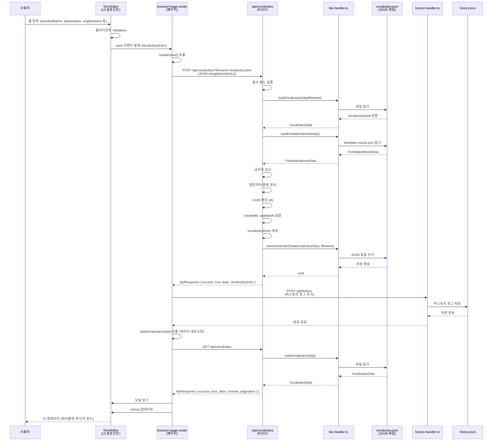
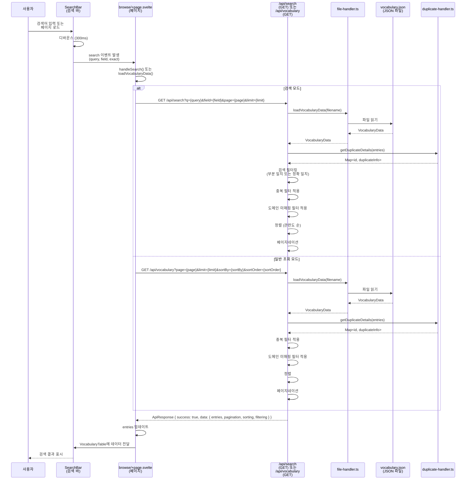
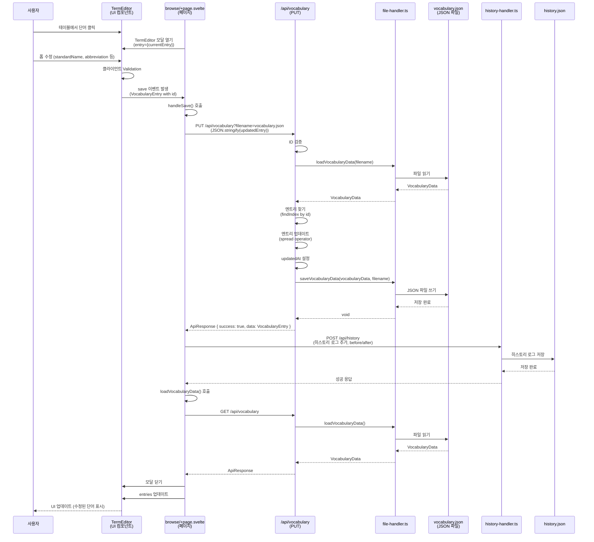
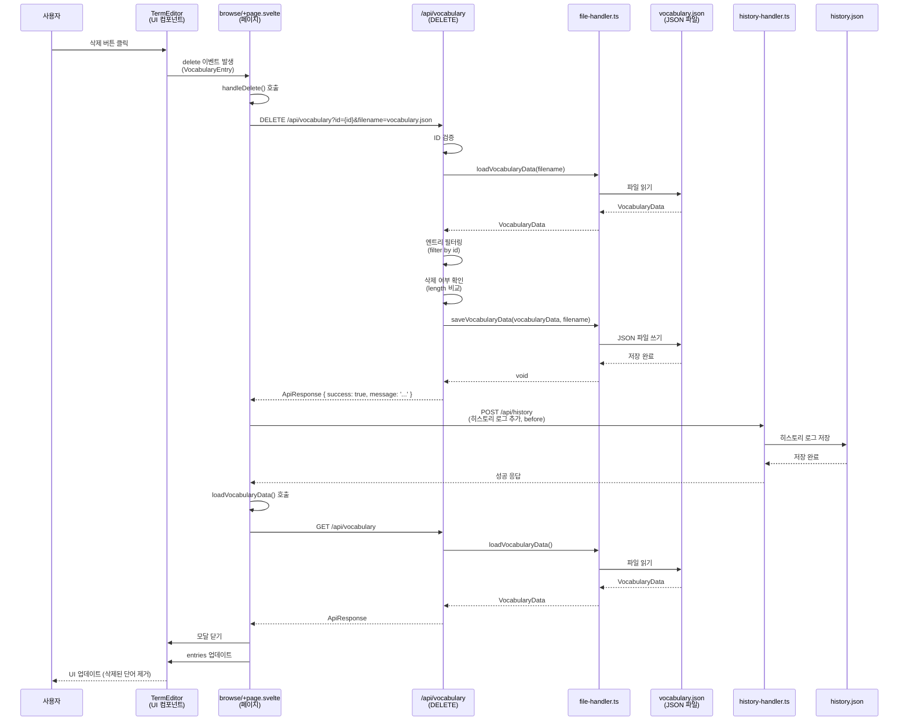
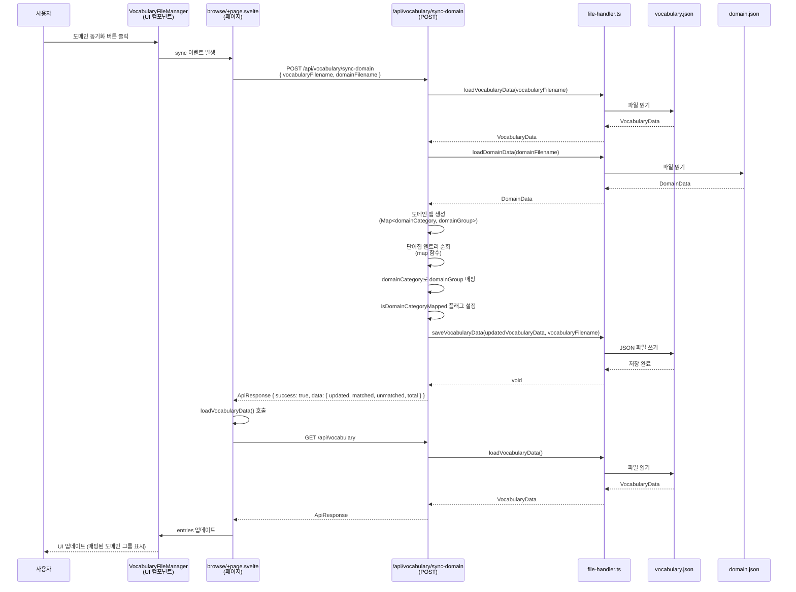
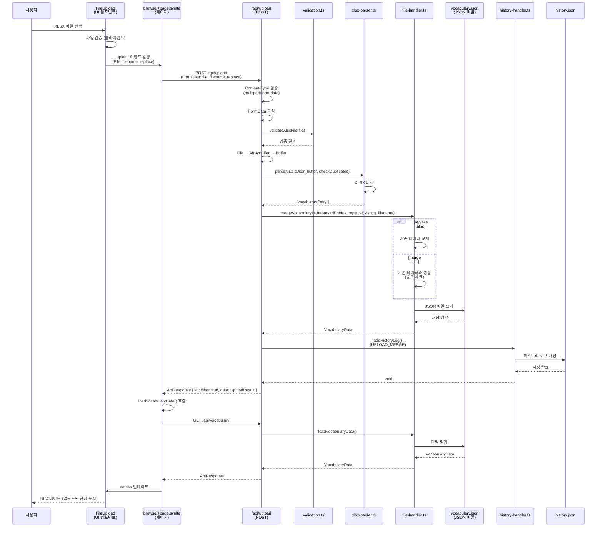

# 데이터 흐름 분석

## 개요

이 문서는 DbManager 프로젝트의 주요 기능별 데이터 흐름을 상세히 분석합니다. UI 레이어부터 데이터 저장소까지의 전체 흐름을 추적하고, 각 단계에서의 타입 변환과 잠재적 문제점을 식별합니다.

---

## 주요 기능 목록

1. **단어 추가 (Vocabulary Create)**
2. **단어 조회 및 검색 (Vocabulary Read/Search)**
3. **단어 수정 (Vocabulary Update)**
4. **단어 삭제 (Vocabulary Delete)**
5. **도메인 매핑 동기화 (Domain Sync)**
6. **파일 업로드 (File Upload)**

---

## 1. 단어 추가 (Vocabulary Create)

### 기능명과 설명

**기능명:** 단어 추가 (Vocabulary Create)

**설명:** 사용자가 새로운 단어를 단어집에 추가하는 기능. 필수 필드 검증, 금지어 검사, 중복 검사를 수행한 후 JSON 파일에 저장합니다.

### 전체 데이터 흐름



### 단계별 상세 분석

#### 1. 사용자 입력 (UI 컴포넌트, 필드)

**컴포넌트:** `TermEditor.svelte`

**입력 필드:**

- `standardName` (string): 표준단어명 (필수)
- `abbreviation` (string): 영문약어 (필수)
- `englishName` (string): 영문명 (필수)
- `description` (string): 설명 (선택)
- `domainCategory` (string): 도메인 분류명 (선택)
- `domainGroup` (string): 도메인 그룹 (선택)

**타입:** `Partial<VocabularyEntry>`

#### 2. 프론트엔드 Validation

**위치:** `TermEditor.svelte`

**검증 로직:**

```typescript
function validateTermName(value: string): string {
	if (!value.trim()) {
		return '용어명은 필수 입력 항목입니다.';
	}
	return '';
}

function validateColumnName(value: string): string {
	if (!value.trim()) {
		return '칼럼명은 필수 입력 항목입니다.';
	}
	return '';
}
```

**검증 항목:**

- 필수 필드 검증: `standardName`, `abbreviation`, `englishName`
- 빈 문자열 검증
- 클라이언트 측에서만 수행 (서버 측 검증도 별도 수행)

#### 3. API 호출 (엔드포인트, 메소드)

**위치:** `src/routes/browse/+page.svelte` - `handleSave()`

**엔드포인트:** `POST /api/vocabulary?filename=vocabulary.json`

**요청 바디:**

```typescript
{
  standardName: string;
  abbreviation: string;
  englishName: string;
  description?: string;
  domainCategory?: string;
  domainGroup?: string;
}
```

**타입 변환:**

- `Partial<VocabularyEntry>` → `JSON.stringify()` → `string` (HTTP 요청 바디)

#### 4. 백엔드 처리 (로직)

**위치:** `src/routes/api/vocabulary/+server.ts` - `POST()`

**처리 단계:**

1. **요청 파싱:**

   ```typescript
   const newEntry: Partial<VocabularyEntry> = await request.json();
   const filename = url.searchParams.get('filename') || undefined;
   ```

2. **필수 필드 검증:**

   ```typescript
   if (!newEntry.standardName || !newEntry.abbreviation || !newEntry.englishName) {
   	return json({ success: false, error: '...' }, { status: 400 });
   }
   ```

3. **데이터 로드:**

   ```typescript
   const vocabularyData = await loadVocabularyData(filename);
   ```

4. **금지어 검사:**

   ```typescript
   const forbiddenWordsData = await loadForbiddenWordsData();
   // 표준단어명, 영문약어에 대해 금지어 검사
   ```

5. **중복 검사:**

   ```typescript
   const isAbbreviationDuplicate = vocabularyData.entries.some(
   	(e) => e.abbreviation === newEntry.abbreviation
   );
   ```

6. **엔트리 생성:**

   ```typescript
   const entryToSave: VocabularyEntry = {
   	id: uuidv4(),
   	standardName: newEntry.standardName,
   	abbreviation: newEntry.abbreviation,
   	englishName: newEntry.englishName,
   	description: newEntry.description || '',
   	createdAt: new Date().toISOString(),
   	updatedAt: new Date().toISOString()
   };
   ```

7. **데이터 저장:**
   ```typescript
   vocabularyData.entries.push(entryToSave);
   await saveVocabularyData(vocabularyData, filename);
   ```

#### 5. DB 쿼리 (어떤 테이블, 어떤 작업)

**데이터 저장소:** JSON 파일 기반

**파일:** `static/data/vocabulary/vocabulary.json`

**작업:**

1. **읽기:** `loadVocabularyData(filename)`
   - 파일 경로: `static/data/vocabulary/{filename}.json`
   - 읽기 작업: `readFile()` → `JSON.parse()`

2. **쓰기:** `saveVocabularyData(vocabularyData, filename)`
   - 파일 경로: `static/data/vocabulary/{filename}.json`
   - 쓰기 작업: `JSON.stringify()` → `writeFile()`

**데이터 구조:**

```json
{
	"entries": [
		{
			"id": "uuid",
			"standardName": "사용자",
			"abbreviation": "USER",
			"englishName": "User",
			"description": "...",
			"createdAt": "2024-01-01T00:00:00.000Z",
			"updatedAt": "2024-01-01T00:00:00.000Z"
		}
	],
	"lastUpdated": "2024-01-01T00:00:00.000Z",
	"totalCount": 1
}
```

#### 6. 응답 생성

**응답 타입:** `ApiResponse`

**성공 응답 (201):**

```typescript
{
	success: true;
	data: VocabularyEntry;
	message: string;
}
```

**에러 응답 (400, 409, 500):**

```typescript
{
	success: false;
	error: string;
	message: string;
}
```

#### 7. UI 업데이트

**위치:** `src/routes/browse/+page.svelte`

**업데이트 단계:**

1. **히스토리 로그 기록:**

   ```typescript
   await fetch('/api/history', {
   	method: 'POST',
   	body: JSON.stringify({
   		action: 'add',
   		targetId: result.data.id,
   		targetName: result.data.standardName,
   		filename: selectedFilename
   	})
   });
   ```

2. **데이터 새로고침:**

   ```typescript
   await loadVocabularyData();
   ```

3. **모달 닫기:**

   ```typescript
   showEditor = false;
   currentEditingEntry = null;
   ```

4. **상태 업데이트:**
   ```typescript
   entries = result.data.entries;
   totalCount = result.data.pagination.totalCount;
   ```

### 각 단계에서 사용되는 타입/인터페이스

| 단계        | 타입/인터페이스                   | 파일 위치                     |
| ----------- | --------------------------------- | ----------------------------- |
| UI 입력     | `Partial<VocabularyEntry>`        | `src/lib/types/vocabulary.ts` |
| 이벤트 전달 | `CustomEvent<VocabularyEntry>`    | Svelte 내장                   |
| API 요청    | `Partial<VocabularyEntry>` (JSON) | -                             |
| API 처리    | `VocabularyEntry`                 | `src/lib/types/vocabulary.ts` |
| 파일 저장   | `VocabularyData`                  | `src/lib/types/vocabulary.ts` |
| API 응답    | `ApiResponse`                     | `src/lib/types/vocabulary.ts` |
| 히스토리    | `HistoryLogEntry`                 | `src/lib/types/vocabulary.ts` |

### 타입 변환이 일어나는 지점

1. **UI → API 요청:**
   - `Partial<VocabularyEntry>` → `JSON.stringify()` → `string`
   - 타입 단언 없음

2. **API 요청 파싱:**
   - `string` → `await request.json()` → `Partial<VocabularyEntry>`
   - 타입 단언: `const newEntry: Partial<VocabularyEntry> = await request.json();`
   - ⚠️ **문제점:** 런타임 검증 없이 타입 단언만 사용

3. **엔트리 생성:**
   - `Partial<VocabularyEntry>` → `VocabularyEntry`
   - 필수 필드 보완: `id`, `createdAt`, `updatedAt` 추가

4. **파일 저장:**
   - `VocabularyData` → `JSON.stringify()` → `string` → 파일 쓰기

5. **파일 읽기:**
   - 파일 읽기 → `string` → `JSON.parse()` → `VocabularyData`
   - 타입 단언: `as VocabularyData`

### 발견된 문제점

1. **타입 불일치:**
   - API 요청 시 `Partial<VocabularyEntry>`를 받지만, 런타임 검증 없이 타입 단언 사용
   - JSON 파싱 결과에 대한 타입 가드 없음

2. **누락:**
   - 클라이언트와 서버의 validation 로직이 중복되어 있지만 일관성 보장 어려움
   - 에러 응답 타입이 `ApiResponse`로 통일되어 있지만, `data` 필드가 없을 때 타입 안전성 부족

3. **타입 안전성:**
   - `request.json()` 결과에 대한 런타임 검증 없음
   - 파일 읽기 시 JSON 파싱 결과에 대한 타입 검증 없음

---

## 2. 단어 조회 및 검색 (Vocabulary Read/Search)

### 기능명과 설명

**기능명:** 단어 조회 및 검색 (Vocabulary Read/Search)

**설명:** 사용자가 단어집 데이터를 조회하거나 검색어를 입력하여 필터링된 결과를 조회하는 기능. 페이지네이션, 정렬, 필터링을 지원합니다.

### 전체 데이터 흐름



### 단계별 상세 분석

#### 1. 사용자 입력 (UI 컴포넌트, 필드)

**컴포넌트:** `SearchBar.svelte`

**입력 필드:**

- `query` (string): 검색어
- `field` (string): 검색 필드 (`all`, `standardName`, `abbreviation`, `englishName`)
- `exact` (boolean): 정확 일치 여부

**타입:** `SearchQuery`

#### 2. 프론트엔드 Validation

**위치:** `SearchBar.svelte`

**검증 로직:**

- 검색어 길이: 1-100자 (서버 측에서 검증)
- 디바운스: 300ms

#### 3. API 호출 (엔드포인트, 메소드)

**검색 모드:**

- **엔드포인트:** `GET /api/search?q={query}&field={field}&exact={exact}&page={page}&limit={limit}&filename={filename}`
- **파일 위치:** `src/routes/api/search/+server.ts`

**일반 조회 모드:**

- **엔드포인트:** `GET /api/vocabulary?page={page}&limit={limit}&sortBy={sortBy}&sortOrder={sortOrder}&filename={filename}`
- **파일 위치:** `src/routes/api/vocabulary/+server.ts`

#### 4. 백엔드 처리 (로직)

**검색 API 처리:**

1. **검색어 검증:**

   ```typescript
   const sanitizedQuery = sanitizeSearchQuery(query);
   if (!sanitizedQuery) {
   	return json({ success: false, error: '...' }, { status: 400 });
   }
   ```

2. **데이터 로드:**

   ```typescript
   const vocabularyData = await loadVocabularyData(filename);
   ```

3. **중복 정보 계산:**

   ```typescript
   const duplicateDetails = getDuplicateDetails(vocabularyData.entries);
   ```

4. **검색 필터링:**

   ```typescript
   const searchResults = entriesWithDuplicateInfo.filter((entry) => {
   	const searchTargets =
   		field === 'all'
   			? [entry.standardName, entry.abbreviation, entry.englishName]
   			: [entry[field]];

   	return searchTargets.some((target) => {
   		if (exact) {
   			return target.toLowerCase() === query.toLowerCase();
   		} else {
   			return target.toLowerCase().includes(query.toLowerCase());
   		}
   	});
   });
   ```

5. **정렬 및 페이지네이션:**
   ```typescript
   const sortedResults = searchResults.sort(/* 관련도 순 정렬 */);
   const paginatedResults = sortedResults.slice(startIndex, endIndex);
   ```

#### 5. DB 쿼리 (어떤 테이블, 어떤 작업)

**데이터 저장소:** JSON 파일 기반

**파일:** `static/data/vocabulary/vocabulary.json`

**작업:**

- **읽기:** `loadVocabularyData(filename)`
  - 전체 파일을 메모리로 로드
  - 메모리에서 필터링/정렬/페이지네이션 수행

**특징:**

- 인덱스 없음 (전체 스캔)
- 대용량 데이터에서 성능 이슈 가능

#### 6. 응답 생성

**응답 타입:** `ApiResponse`

**성공 응답 (200):**

```typescript
{
  success: true;
  data: {
    entries: VocabularyEntry[];
    totalCount: number;
    query: SearchQuery;
    pagination: {
      currentPage: number;
      totalPages: number;
      totalResults: number;
      limit: number;
      hasNextPage: boolean;
      hasPrevPage: boolean;
    };
    searchInfo: {
      originalQuery: string;
      sanitizedQuery: string;
      field: string;
      exact: boolean;
      executionTime: number;
    };
    filtering: {
      filter: string;
      isFiltered: boolean;
    };
  };
  message: string;
}
```

#### 7. UI 업데이트

**위치:** `src/routes/browse/+page.svelte`

**업데이트 단계:**

1. **상태 업데이트:**

   ```typescript
   entries = result.data.entries;
   totalCount = result.data.pagination.totalResults;
   totalPages = result.data.pagination.totalPages;
   currentPage = result.data.pagination.currentPage;
   ```

2. **테이블 업데이트:**
   ```typescript
   <VocabularyTable {entries} {totalCount} {currentPage} {totalPages} />
   ```

### 각 단계에서 사용되는 타입/인터페이스

| 단계      | 타입/인터페이스              | 파일 위치                            |
| --------- | ---------------------------- | ------------------------------------ |
| 검색 입력 | `SearchQuery`                | `src/lib/types/vocabulary.ts`        |
| API 요청  | Query Parameters             | -                                    |
| API 처리  | `VocabularyEntry[]`          | `src/lib/types/vocabulary.ts`        |
| 중복 정보 | `Map<string, DuplicateInfo>` | `src/lib/utils/duplicate-handler.ts` |
| API 응답  | `ApiResponse<SearchResult>`  | `src/lib/types/vocabulary.ts`        |
| UI 상태   | `VocabularyEntry[]`          | `src/lib/types/vocabulary.ts`        |

### 타입 변환이 일어나는 지점

1. **검색어 입력:**
   - `string` → `sanitizeSearchQuery()` → `string` (정제된 검색어)

2. **중복 정보 추가:**
   - `VocabularyEntry[]` → `getDuplicateDetails()` → `Map<id, duplicateInfo>`
   - 각 엔트리에 `duplicateInfo` 속성 추가

3. **필터링:**
   - `VocabularyEntry[]` → 필터링 → `VocabularyEntry[]`

4. **페이지네이션:**
   - `VocabularyEntry[]` → `slice()` → `VocabularyEntry[]`

### 발견된 문제점

1. **성능 문제:**
   - 전체 파일을 메모리로 로드하여 대용량 데이터에서 성능 이슈
   - 인덱스 없이 전체 스캔 수행

2. **타입 안전성:**
   - 검색 결과에 `duplicateInfo`가 런타임에 추가되지만 타입 정의에는 선택적 필드로만 정의됨

3. **일관성:**
   - 검색 API와 일반 조회 API의 응답 구조가 약간 다름 (`totalResults` vs `totalCount`)

---

## 3. 단어 수정 (Vocabulary Update)

### 기능명과 설명

**기능명:** 단어 수정 (Vocabulary Update)

**설명:** 사용자가 기존 단어의 정보를 수정하는 기능. ID를 기반으로 엔트리를 찾아 업데이트합니다.

### 전체 데이터 흐름



### 단계별 상세 분석

#### 1. 사용자 입력 (UI 컴포넌트, 필드)

**컴포넌트:** `TermEditor.svelte`

**입력 필드:**

- 기존 엔트리의 모든 필드 (수정 가능)
- `id` 필드는 수정 불가 (읽기 전용)

**타입:** `VocabularyEntry` (id 포함)

#### 2. 프론트엔드 Validation

**위치:** `TermEditor.svelte`

**검증 로직:**

- 필수 필드 검증 (동일)
- 클라이언트 측에서만 수행

#### 3. API 호출 (엔드포인트, 메소드)

**위치:** `src/routes/browse/+page.svelte` - `handleSave()`

**엔드포인트:** `PUT /api/vocabulary?filename=vocabulary.json`

**요청 바디:**

```typescript
{
  id: string;                    // 필수
  standardName: string;
  abbreviation: string;
  englishName: string;
  description?: string;
  // ... 기타 필드
}
```

#### 4. 백엔드 처리 (로직)

**위치:** `src/routes/api/vocabulary/+server.ts` - `PUT()`

**처리 단계:**

1. **요청 파싱:**

   ```typescript
   const updatedEntry: VocabularyEntry = await request.json();
   const filename = url.searchParams.get('filename') || undefined;
   ```

2. **ID 검증:**

   ```typescript
   if (!updatedEntry.id) {
   	return json({ success: false, error: '단어 ID가 필요합니다.' }, { status: 400 });
   }
   ```

3. **데이터 로드:**

   ```typescript
   const vocabularyData = await loadVocabularyData(filename);
   ```

4. **엔트리 찾기:**

   ```typescript
   const entryIndex = vocabularyData.entries.findIndex((e) => e.id === updatedEntry.id);
   if (entryIndex === -1) {
   	return json({ success: false, error: '수정할 단어를 찾을 수 없습니다.' }, { status: 404 });
   }
   ```

5. **엔트리 업데이트:**

   ```typescript
   vocabularyData.entries[entryIndex] = {
   	...vocabularyData.entries[entryIndex],
   	...updatedEntry,
   	isDomainCategoryMapped: updatedEntry.isDomainCategoryMapped ?? false,
   	updatedAt: new Date().toISOString()
   };
   ```

6. **데이터 저장:**
   ```typescript
   await saveVocabularyData(vocabularyData, filename);
   ```

#### 5. DB 쿼리 (어떤 테이블, 어떤 작업)

**데이터 저장소:** JSON 파일 기반

**파일:** `static/data/vocabulary/vocabulary.json`

**작업:**

1. **읽기:** `loadVocabularyData(filename)`
2. **수정:** 메모리에서 배열 요소 업데이트
3. **쓰기:** `saveVocabularyData(vocabularyData, filename)`

**특징:**

- 원자성 보장 어려움 (파일 기반 특성상)
- 동시 수정 시 데이터 손실 가능

#### 6. 응답 생성

**응답 타입:** `ApiResponse`

**성공 응답 (200):**

```typescript
{
	success: true;
	data: VocabularyEntry;
	message: string;
}
```

#### 7. UI 업데이트

**위치:** `src/routes/browse/+page.svelte`

**업데이트 단계:**

1. **히스토리 로그 기록:**

   ```typescript
   await fetch('/api/history', {
     method: 'POST',
     body: JSON.stringify({
       action: 'update',
       targetId: result.data.id,
       targetName: result.data.standardName,
       filename: selectedFilename,
       details: {
         before: originalEntry ? { ... } : undefined,
         after: { ... }
       }
     })
   });
   ```

2. **데이터 새로고침 및 모달 닫기**

### 각 단계에서 사용되는 타입/인터페이스

| 단계      | 타입/인터페이스          | 파일 위치                     |
| --------- | ------------------------ | ----------------------------- |
| UI 입력   | `VocabularyEntry`        | `src/lib/types/vocabulary.ts` |
| API 요청  | `VocabularyEntry` (JSON) | -                             |
| API 처리  | `VocabularyEntry`        | `src/lib/types/vocabulary.ts` |
| 파일 저장 | `VocabularyData`         | `src/lib/types/vocabulary.ts` |
| API 응답  | `ApiResponse`            | `src/lib/types/vocabulary.ts` |
| 히스토리  | `HistoryLogEntry`        | `src/lib/types/vocabulary.ts` |

### 타입 변환이 일어나는 지점

1. **엔트리 업데이트:**
   - 기존 엔트리 + 업데이트 필드 → 스프레드 연산자로 병합
   - `updatedAt` 필드만 새로 설정

2. **히스토리 로그:**
   - `before`: `Partial<VocabularyEntry>` (변경 전 일부 필드)
   - `after`: `Partial<VocabularyEntry>` (변경 후 일부 필드)

### 발견된 문제점

1. **동시성 문제:**
   - 파일 기반 저장소의 특성상 동시 수정 시 데이터 손실 가능
   - 트랜잭션 없음

2. **부분 업데이트:**
   - 스프레드 연산자로 병합하지만, `undefined` 값이 전달되면 기존 값이 유지되지 않을 수 있음

3. **타입 안전성:**
   - `request.json()` 결과에 대한 런타임 검증 없음

---

## 4. 단어 삭제 (Vocabulary Delete)

### 기능명과 설명

**기능명:** 단어 삭제 (Vocabulary Delete)

**설명:** 사용자가 단어를 삭제하는 기능. ID를 기반으로 엔트리를 찾아 배열에서 제거합니다.

### 전체 데이터 흐름



### 단계별 상세 분석

#### 1. 사용자 입력 (UI 컴포넌트, 필드)

**컴포넌트:** `TermEditor.svelte`

**입력:** 삭제 버튼 클릭

**데이터:** `VocabularyEntry` (삭제할 엔트리)

#### 2. 프론트엔드 Validation

**위치:** `TermEditor.svelte`

**검증 로직:**

- 확인 다이얼로그 (선택적)
- 클라이언트 측에서만 수행

#### 3. API 호출 (엔드포인트, 메소드)

**위치:** `src/routes/browse/+page.svelte` - `handleDelete()`

**엔드포인트:** `DELETE /api/vocabulary?id={id}&filename=vocabulary.json`

**요청 바디:** 없음 (Query Parameter만 사용)

#### 4. 백엔드 처리 (로직)

**위치:** `src/routes/api/vocabulary/+server.ts` - `DELETE()`

**처리 단계:**

1. **ID 추출:**

   ```typescript
   const id = url.searchParams.get('id');
   const filename = url.searchParams.get('filename') || undefined;
   ```

2. **ID 검증:**

   ```typescript
   if (!id) {
   	return json({ success: false, error: '삭제할 단어의 ID가 필요합니다.' }, { status: 400 });
   }
   ```

3. **데이터 로드:**

   ```typescript
   const vocabularyData = await loadVocabularyData(filename);
   ```

4. **엔트리 삭제:**

   ```typescript
   const initialLength = vocabularyData.entries.length;
   vocabularyData.entries = vocabularyData.entries.filter((e) => e.id !== id);
   ```

5. **삭제 확인:**

   ```typescript
   if (vocabularyData.entries.length === initialLength) {
   	return json({ success: false, error: '삭제할 단어를 찾을 수 없습니다.' }, { status: 404 });
   }
   ```

6. **데이터 저장:**
   ```typescript
   await saveVocabularyData(vocabularyData, filename);
   ```

#### 5. DB 쿼리 (어떤 테이블, 어떤 작업)

**데이터 저장소:** JSON 파일 기반

**파일:** `static/data/vocabulary/vocabulary.json`

**작업:**

1. **읽기:** `loadVocabularyData(filename)`
2. **삭제:** 메모리에서 배열 필터링
3. **쓰기:** `saveVocabularyData(vocabularyData, filename)`

#### 6. 응답 생성

**응답 타입:** `ApiResponse`

**성공 응답 (200):**

```typescript
{
	success: true;
	message: string;
}
```

**에러 응답 (400, 404, 500):**

```typescript
{
	success: false;
	error: string;
	message: string;
}
```

#### 7. UI 업데이트

**위치:** `src/routes/browse/+page.svelte`

**업데이트 단계:**

1. **히스토리 로그 기록**
2. **데이터 새로고침**
3. **모달 닫기**

### 각 단계에서 사용되는 타입/인터페이스

| 단계      | 타입/인터페이스        | 파일 위치                     |
| --------- | ---------------------- | ----------------------------- |
| UI 입력   | `VocabularyEntry`      | `src/lib/types/vocabulary.ts` |
| API 요청  | Query Parameter (`id`) | -                             |
| API 처리  | `string` (id)          | -                             |
| 파일 저장 | `VocabularyData`       | `src/lib/types/vocabulary.ts` |
| API 응답  | `ApiResponse`          | `src/lib/types/vocabulary.ts` |
| 히스토리  | `HistoryLogEntry`      | `src/lib/types/vocabulary.ts` |

### 타입 변환이 일어나는 지점

1. **ID 추출:**
   - Query Parameter: `string | null` → `string` (검증 후)

2. **필터링:**
   - `VocabularyEntry[]` → `filter()` → `VocabularyEntry[]`

### 발견된 문제점

1. **동시성 문제:**
   - 파일 기반 저장소의 특성상 동시 삭제 시 데이터 손실 가능

2. **참조 무결성:**
   - 다른 엔트리에서 참조하는 경우 검증 없음
   - 외래 키 제약조건 없음

---

## 5. 도메인 매핑 동기화 (Domain Sync)

### 기능명과 설명

**기능명:** 도메인 매핑 동기화 (Domain Sync)

**설명:** 단어집의 도메인 분류명(`domainCategory`)을 도메인 데이터와 매칭하여 도메인 그룹(`domainGroup`)을 자동으로 매핑하는 기능.

### 전체 데이터 흐름



### 단계별 상세 분석

#### 1. 사용자 입력 (UI 컴포넌트, 필드)

**컴포넌트:** `VocabularyFileManager.svelte`

**입력:** 도메인 동기화 버튼 클릭

**파라미터:**

- `vocabularyFilename` (string): 단어집 파일명
- `domainFilename` (string): 도메인 파일명

#### 2. 프론트엔드 Validation

**위치:** `VocabularyFileManager.svelte`

**검증 로직:**

- 파일명 존재 여부 확인
- 클라이언트 측에서만 수행

#### 3. API 호출 (엔드포인트, 메소드)

**위치:** `src/routes/browse/+page.svelte` 또는 `VocabularyFileManager.svelte`

**엔드포인트:** `POST /api/vocabulary/sync-domain`

**요청 바디:**

```typescript
{
  vocabularyFilename?: string;
  domainFilename?: string;
}
```

#### 4. 백엔드 처리 (로직)

**위치:** `src/routes/api/vocabulary/sync-domain/+server.ts` - `POST()`

**처리 단계:**

1. **요청 파싱:**

   ```typescript
   const { vocabularyFilename, domainFilename }: SyncRequest = await request.json();
   const vocabFile = vocabularyFilename || 'vocabulary.json';
   ```

2. **단어집 데이터 로드:**

   ```typescript
   const vocabularyData = await loadVocabularyData(vocabFile);
   ```

3. **도메인 데이터 로드:**

   ```typescript
   const domainData = await loadDomainData(domainFile);
   ```

4. **도메인 맵 생성:**

   ```typescript
   const domainMap = new Map<string, string>();
   domainData.entries.forEach((entry: DomainEntry) => {
   	if (entry.domainCategory && entry.domainGroup) {
   		domainMap.set(entry.domainCategory.trim().toLowerCase(), entry.domainGroup);
   	}
   });
   ```

5. **매핑 수행:**

   ```typescript
   const mappedEntries: VocabularyEntry[] = vocabularyData.entries.map((entry) => {
   	if (!entry.domainCategory) {
   		return { ...entry, isDomainCategoryMapped: false };
   	}
   	const key = entry.domainCategory.trim().toLowerCase();
   	const mappedGroup = domainMap.get(key);
   	if (mappedGroup) {
   		return {
   			...entry,
   			domainGroup: mappedGroup,
   			isDomainCategoryMapped: true,
   			updatedAt: new Date().toISOString()
   		};
   	}
   	return { ...entry, isDomainCategoryMapped: false };
   });
   ```

6. **데이터 저장:**
   ```typescript
   const finalData: VocabularyData = {
   	...vocabularyData,
   	entries: mappedEntries,
   	mapping: { domain: domainFile },
   	lastUpdated: new Date().toISOString()
   };
   await saveVocabularyData(finalData, vocabFile);
   ```

#### 5. DB 쿼리 (어떤 테이블, 어떤 작업)

**데이터 저장소:** JSON 파일 기반

**파일:**

- `static/data/vocabulary/vocabulary.json` (읽기/쓰기)
- `static/data/domain/domain.json` (읽기)

**작업:**

1. **읽기:** `loadVocabularyData()`, `loadDomainData()`
2. **매핑:** 메모리에서 맵 생성 및 매핑 수행
3. **쓰기:** `saveVocabularyData()`

#### 6. 응답 생성

**응답 타입:** `ApiResponse`

**성공 응답 (200):**

```typescript
{
	success: true;
	data: {
		vocabularyFilename: string;
		domainFilename: string;
		updated: number; // 업데이트된 엔트리 수
		matched: number; // 매핑 성공 수
		unmatched: number; // 매핑 실패 수
		total: number; // 전체 엔트리 수
	}
	message: string;
}
```

#### 7. UI 업데이트

**위치:** `src/routes/browse/+page.svelte`

**업데이트 단계:**

1. **데이터 새로고침**
2. **매핑 결과 표시** (선택적)

### 각 단계에서 사용되는 타입/인터페이스

| 단계          | 타입/인터페이스       | 파일 위치                                          |
| ------------- | --------------------- | -------------------------------------------------- |
| API 요청      | `SyncRequest`         | `src/routes/api/vocabulary/sync-domain/+server.ts` |
| 단어집 데이터 | `VocabularyData`      | `src/lib/types/vocabulary.ts`                      |
| 도메인 데이터 | `DomainData`          | `src/lib/types/domain.ts`                          |
| 도메인 맵     | `Map<string, string>` | 내장                                               |
| 매핑된 엔트리 | `VocabularyEntry[]`   | `src/lib/types/vocabulary.ts`                      |
| API 응답      | `ApiResponse`         | `src/lib/types/vocabulary.ts`                      |

### 타입 변환이 일어나는 지점

1. **도메인 맵 생성:**
   - `DomainEntry[]` → `Map<string, string>`
   - 키: `domainCategory.trim().toLowerCase()`
   - 값: `domainGroup`

2. **매핑 수행:**
   - `VocabularyEntry[]` → `map()` → `VocabularyEntry[]`
   - 각 엔트리에 `domainGroup`, `isDomainCategoryMapped` 추가/업데이트

3. **대소문자 정규화:**
   - `domainCategory` → `trim().toLowerCase()` (매핑 키 생성 시)

### 발견된 문제점

1. **대소문자 민감성:**
   - 매핑 시 대소문자를 무시하지만, 원본 데이터는 대소문자를 유지
   - 일관성 문제 가능

2. **부분 문자열 매칭:**
   - 정확 일치만 지원 (부분 문자열 매칭 없음)

3. **성능:**
   - 전체 단어집을 순회하며 매핑 수행
   - 대용량 데이터에서 성능 이슈 가능

---

## 6. 파일 업로드 (File Upload)

### 기능명과 설명

**기능명:** 파일 업로드 (File Upload)

**설명:** 사용자가 XLSX 파일을 업로드하여 대량의 단어를 일괄 추가하는 기능. 파일 검증, 파싱, 중복 체크, 병합을 수행합니다.

### 전체 데이터 흐름



### 단계별 상세 분석

#### 1. 사용자 입력 (UI 컴포넌트, 필드)

**컴포넌트:** `FileUpload.svelte`

**입력 필드:**

- `file` (File): XLSX 파일
- `filename` (string): 저장할 파일명
- `replace` (boolean): 교체 모드 여부

#### 2. 프론트엔드 Validation

**위치:** `FileUpload.svelte`

**검증 로직:**

- 파일 형식: `.xlsx`, `.xls`
- 파일 크기: 최대 10MB
- 클라이언트 측에서만 수행 (서버 측 검증도 별도 수행)

#### 3. API 호출 (엔드포인트, 메소드)

**위치:** `src/routes/browse/+page.svelte` 또는 `FileUpload.svelte`

**엔드포인트:** `POST /api/upload`

**요청 형식:** `multipart/form-data`

**FormData:**

- `file`: File 객체
- `filename`: string
- `replace`: string (`'true'` 또는 `'false'`)

#### 4. 백엔드 처리 (로직)

**위치:** `src/routes/api/upload/+server.ts` - `POST()`

**처리 단계:**

1. **Content-Type 검증:**

   ```typescript
   const contentType = request.headers.get('content-type');
   if (!contentType?.includes('multipart/form-data')) {
   	return json({ success: false, error: '...' }, { status: 400 });
   }
   ```

2. **FormData 파싱:**

   ```typescript
   const formData = await request.formData();
   const file = formData.get('file') as File;
   const filename = (formData.get('filename') as string) || 'vocabulary.json';
   ```

3. **파일 검증:**

   ```typescript
   validateXlsxFile(file);
   ```

4. **Buffer 변환:**

   ```typescript
   const arrayBuffer = await file.arrayBuffer();
   const buffer = Buffer.from(arrayBuffer);
   ```

5. **XLSX 파싱:**

   ```typescript
   const parsedEntries = parseXlsxToJson(buffer, !replaceExisting);
   ```

6. **데이터 병합:**

   ```typescript
   const finalData = await mergeVocabularyData(parsedEntries, replaceExisting, filename);
   ```

7. **히스토리 로그 기록:**
   ```typescript
   if (!replaceExisting) {
   	await addHistoryLog({
   		action: 'UPLOAD_MERGE',
   		targetName: `${file.name} (${parsedEntries.length}개 단어)`,
   		details: {
   			fileName: file.name,
   			fileSize: file.size,
   			processedCount: parsedEntries.length,
   			replaceMode: replaceExisting
   		}
   	});
   }
   ```

#### 5. DB 쿼리 (어떤 테이블, 어떤 작업)

**데이터 저장소:** JSON 파일 기반

**파일:** `static/data/vocabulary/vocabulary.json`

**작업:**

1. **읽기:** `loadVocabularyData(filename)` (병합 모드일 때)
2. **병합/교체:** 메모리에서 배열 병합 또는 교체
3. **쓰기:** `saveVocabularyData(finalData, filename)`

**병합 로직:**

- **교체 모드:** 기존 데이터를 새 데이터로 완전 교체
- **병합 모드:** 기존 데이터와 새 데이터를 병합 (중복 체크)

#### 6. 응답 생성

**응답 타입:** `ApiResponse`

**성공 응답 (200):**

```typescript
{
  success: true;
  data: {
    success: boolean;
    message: string;
    data?: VocabularyData;
    uploadedAt?: string;
    totalEntries?: number;
  };
  message: string;
}
```

#### 7. UI 업데이트

**위치:** `src/routes/browse/+page.svelte`

**업데이트 단계:**

1. **데이터 새로고침**
2. **업로드 결과 메시지 표시**

### 각 단계에서 사용되는 타입/인터페이스

| 단계      | 타입/인터페이스             | 파일 위치                     |
| --------- | --------------------------- | ----------------------------- |
| 파일 입력 | `File`                      | 브라우저 API                  |
| FormData  | `FormData`                  | 브라우저 API                  |
| API 요청  | `multipart/form-data`       | -                             |
| 파싱 결과 | `VocabularyEntry[]`         | `src/lib/types/vocabulary.ts` |
| 병합 결과 | `VocabularyData`            | `src/lib/types/vocabulary.ts` |
| API 응답  | `ApiResponse<UploadResult>` | `src/lib/types/vocabulary.ts` |
| 히스토리  | `HistoryLogEntry`           | `src/lib/types/vocabulary.ts` |

### 타입 변환이 일어나는 지점

1. **파일 → Buffer:**
   - `File` → `arrayBuffer()` → `ArrayBuffer` → `Buffer.from()` → `Buffer`

2. **Buffer → JSON:**
   - `Buffer` → `parseXlsxToJson()` → `VocabularyEntry[]`

3. **병합:**
   - `VocabularyEntry[]` (새 데이터) + `VocabularyEntry[]` (기존 데이터) → `VocabularyEntry[]` (병합된 데이터)

4. **VocabularyEntry[] → VocabularyData:**
   - 배열을 `VocabularyData` 구조로 변환
   - `totalCount`, `lastUpdated` 추가

### 발견된 문제점

1. **타입 안전성:**
   - `formData.get('file') as File` - 타입 단언 사용
   - `formData.get('replace') === 'true'` - 문자열 비교

2. **에러 처리:**
   - XLSX 파싱 실패 시 상세한 에러 메시지 부족
   - 어떤 행에서 오류가 발생했는지 알기 어려움

3. **성능:**
   - 대용량 파일 업로드 시 메모리 사용량 증가
   - 스트리밍 처리 없음

4. **데이터 무결성:**
   - 병합 모드에서 중복 체크는 하지만, 부분 업데이트는 불가능
   - 교체 모드에서 기존 데이터 완전 삭제

---

## 종합 분석

### 공통 문제점

1. **타입 안전성:**
   - `request.json()` 결과에 대한 런타임 검증 없음
   - 타입 단언(`as`) 남용
   - JSON 파싱 결과에 대한 타입 가드 없음

2. **동시성 문제:**
   - 파일 기반 저장소의 특성상 동시 수정 시 데이터 손실 가능
   - 트랜잭션 없음
   - 락 메커니즘 없음

3. **에러 처리:**
   - 일관성 없는 에러 메시지
   - 상세한 에러 정보 부족
   - 에러 복구 메커니즘 없음

4. **성능:**
   - 전체 파일을 메모리로 로드
   - 인덱스 없음
   - 대용량 데이터에서 성능 이슈 가능

5. **데이터 무결성:**
   - 외래 키 제약조건 없음
   - 참조 무결성 검증 없음
   - 부분 업데이트 시 `undefined` 값 처리 불명확

### 개선 제안

1. **타입 안전성 강화:**
   - JSON Schema 또는 Zod를 사용한 런타임 검증
   - 타입 가드 함수 구현
   - 타입 단언 최소화

2. **동시성 제어:**
   - 파일 락 메커니즘 도입
   - 또는 데이터베이스로 마이그레이션 고려

3. **에러 처리 개선:**
   - 일관된 에러 응답 형식
   - 상세한 에러 메시지
   - 에러 로깅 강화

4. **성능 최적화:**
   - 인덱스 파일 생성
   - 스트리밍 처리
   - 캐싱 메커니즘 도입

5. **데이터 무결성:**
   - 참조 무결성 검증 로직 추가
   - 부분 업데이트 시 명시적 처리

---

**마지막 업데이트**: 2024-01-01
