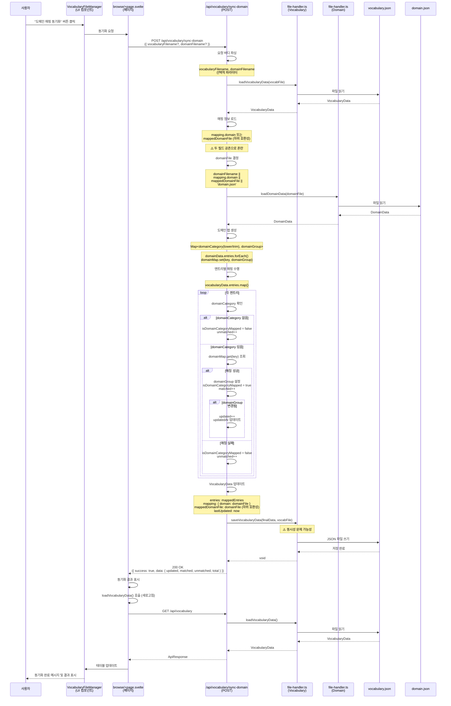

# 도메인 매핑 동기화 (Domain Sync) 기능 상세 분석

**마지막 업데이트**: 2024-01-01

---

## 1. 기능 개요

### 목적

단어집의 도메인 분류명(`domainCategory`)을 도메인 데이터와 매칭하여 도메인 그룹(`domainGroup`)을 자동으로 매핑하는 기능입니다. 대량의 단어에 대해 일괄적으로 도메인 매핑을 수행합니다.

### 사용자 시나리오

1. **시나리오 1: 정상 동기화**
   - 사용자가 단어집 관리 페이지에서 "도메인 매핑 동기화" 버튼 클릭
   - 단어집의 `domainCategory`와 도메인 데이터의 `domainCategory`를 비교
   - 매칭되는 경우 `domainGroup` 자동 설정
   - 동기화 결과 표시 (업데이트된 개수, 매칭된 개수, 미매칭 개수)

2. **시나리오 2: 부분 매칭**
   - 일부 단어만 `domainCategory`가 있는 경우
   - `domainCategory`가 있는 단어만 매핑 시도
   - `domainCategory`가 없는 단어는 미매핑으로 표시

---

## 2. 구현 상세

### 관련 파일 전체 목록

#### UI 레이어

- **페이지 컴포넌트**:
  - `src/routes/browse/+page.svelte`
    - 도메인 매핑 동기화 버튼
    - 동기화 결과 표시

- **파일 관리 컴포넌트**:
  - `src/lib/components/VocabularyFileManager.svelte`
    - 동기화 버튼 및 결과 표시

#### API 레이어

- **동기화 API 엔드포인트**:
  - `src/routes/api/vocabulary/sync-domain/+server.ts` (107줄)
    - `POST` 메소드 (11-105줄)

#### DB/유틸리티 레이어

- **파일 핸들러**:
  - `src/lib/utils/file-handler.ts`
    - `loadVocabularyData()` (208-283줄)
    - `saveVocabularyData()` (159-202줄)
    - `loadDomainData()` (574-619줄)

- **타입 정의**:
  - `src/lib/types/vocabulary.ts`
    - `VocabularyEntry` 인터페이스
    - `VocabularyData` 인터페이스
  - `src/lib/types/domain.ts`
    - `DomainEntry` 인터페이스
    - `DomainData` 인터페이스

### 코드 구조

```
browse/+page.svelte
  └─ VocabularyFileManager 컴포넌트
      └─ 동기화 버튼 클릭
          └─ POST /api/vocabulary/sync-domain 호출

/api/vocabulary/sync-domain/+server.ts
  ├─ 요청 바디 파싱
  ├─ loadVocabularyData()
  ├─ 매핑 정보 로드 (mapping.domain 또는 mappedDomainFile)
  ├─ loadDomainData()
  ├─ 도메인 맵 생성 (domainCategory -> domainGroup)
  ├─ 엔트리별 매핑 수행
  ├─ saveVocabularyData()
  └─ 응답 반환
```

---

## 3. 데이터 흐름

### 상세 시퀀스 다이어그램



### 각 단계별 사용 타입

| 단계          | 타입/인터페이스           | 파일 위치                 | 설명                                       |
| ------------- | ------------------------- | ------------------------- | ------------------------------------------ |
| 요청 바디     | `SyncRequest`             | `+server.ts:6-9`          | `{ vocabularyFilename?, domainFilename? }` |
| 단어집 데이터 | `VocabularyData`          | `file-handler.ts:208-283` | 전체 단어집 데이터                         |
| 매핑 정보     | `VocabularyData.mapping`  | `+server.ts:21-24`        | `mapping.domain` 또는 `mappedDomainFile`   |
| 도메인 데이터 | `DomainData`              | `file-handler.ts:574-619` | 전체 도메인 데이터                         |
| 도메인 맵     | `Map<string, string>`     | `+server.ts:28-33`        | `domainCategory -> domainGroup`            |
| 매핑된 엔트리 | `VocabularyEntry[]`       | `+server.ts:41-66`        | 매핑 결과가 반영된 엔트리 배열             |
| 최종 데이터   | `VocabularyData`          | `+server.ts:69-77`        | 업데이트된 단어집 데이터                   |
| 응답 데이터   | `ApiResponse<SyncResult>` | `+server.ts:83-93`        | 동기화 결과 통계                           |

### 타입 변환 지점

1. **요청 바디 → SyncRequest**
   - 위치: `+server.ts:13`
   - 변환: `await request.json()` → 타입 단언
   - ⚠️ 문제: 런타임 검증 없음

2. **도메인 엔트리 → Map**
   - 위치: `+server.ts:28-33`
   - 변환: `DomainEntry[]` → `Map<domainCategory, domainGroup>`
   - 키: `domainCategory.trim().toLowerCase()`

3. **VocabularyEntry → 매핑된 VocabularyEntry**
   - 위치: `+server.ts:41-66`
   - 변환: `domainCategory` 기반으로 `domainGroup` 설정, `isDomainCategoryMapped` 플래그 설정

---

## 4. 현재 구현 상태

### 작동하는 부분

✅ **정상 작동**:

- 단어집 및 도메인 데이터 로드
- 매핑 정보 로드 (하위 호환성 고려)
- 도메인 맵 생성
- 엔트리별 매핑 수행
- 매핑 결과 통계 계산 (updated, matched, unmatched)
- 데이터 저장
- UI 업데이트

### 작동하지 않는 부분

❌ **문제점**:

- 동시성 문제: 동시 동기화 시 데이터 손실 가능 (#C1)
- 하위 호환성 필드 중복: `mappedDomainFile`과 `mapping.domain` 공존 (#H1)
- 런타임 타입 검증 없음: JSON 파싱 시 타입 단언만 사용 (#C2)

---

## 5. 발견된 문제점

### 버그

1. **동시성 문제 (#C1)**
   - **심각도**: Critical
   - **위치**: `file-handler.ts` (전체 파일)
   - **문제**: 동시 동기화 시 마지막 쓰기가 이전 변경사항을 덮어씀
   - **재현**: 두 사용자가 동시에 동기화 실행
   - **영향**: 데이터 손실

2. **하위 호환성 필드 중복 (#H1)**
   - **심각도**: High Priority
   - **위치**: `+server.ts:21-24, 75`
   - **문제**: `mappedDomainFile`과 `mapping.domain` 두 필드 공존
   - **재현**: 기존 파일과 새 파일 간 필드 불일치
   - **영향**: 데이터 일관성 문제, 코드 복잡도 증가

### 개선 필요 사항

1. **성능 최적화**
   - **심각도**: Medium Priority
   - **위치**: `+server.ts:28-33, 41-66`
   - **문제**: 전체 단어집과 도메인 데이터를 메모리로 로드
   - **영향**: 대용량 데이터에서 성능 저하
   - **개선**: 인덱스 파일 또는 스트리밍 처리

2. **에러 처리 개선**
   - **심각도**: Medium Priority
   - **위치**: `+server.ts:95-104`
   - **문제**: 일반적인 에러 메시지만 반환
   - **영향**: 디버깅 어려움
   - **개선**: 상세한 에러 메시지 및 로깅

---

## 6. 개선 제안

### 수정 방향

#### 1. 하위 호환성 필드 통합

**방향**: `mappedDomainFile` 필드 제거, `mapping.domain`만 사용

```typescript
// +server.ts
export async function POST({ request }: RequestEvent) {
	try {
		const { vocabularyFilename, domainFilename }: SyncRequest = await request.json();
		const vocabFile = vocabularyFilename || 'vocabulary.json';

		// 단어집 로드
		const vocabularyData = await loadVocabularyData(vocabFile);

		// 매핑 정보 로드 (mapping.domain 우선, mappedDomainFile은 하위 호환성)
		const domainFile =
			domainFilename ||
			vocabularyData.mapping?.domain ||
			vocabularyData.mappedDomainFile ||
			'domain.json';

		// 도메인 데이터 로드
		const domainData = await loadDomainData(domainFile);

		// 도메인 맵 생성
		const domainMap = new Map<string, string>();
		domainData.entries.forEach((entry: DomainEntry) => {
			if (entry.domainCategory && entry.domainGroup) {
				domainMap.set(entry.domainCategory.trim().toLowerCase(), entry.domainGroup);
			}
		});

		// 매핑 수행
		let updated = 0;
		let matched = 0;
		let unmatched = 0;
		const now = new Date().toISOString();

		const mappedEntries: VocabularyEntry[] = vocabularyData.entries.map((entry) => {
			if (!entry.domainCategory) {
				unmatched += 1;
				return { ...entry, isDomainCategoryMapped: false };
			}

			const key = entry.domainCategory.trim().toLowerCase();
			const mappedGroup = domainMap.get(key);

			if (mappedGroup) {
				matched += 1;
				const shouldUpdateGroup = entry.domainGroup !== mappedGroup;
				const shouldUpdateFlag = entry.isDomainCategoryMapped !== true;

				if (shouldUpdateGroup || shouldUpdateFlag) {
					updated += 1;
					return {
						...entry,
						domainGroup: mappedGroup,
						isDomainCategoryMapped: true,
						updatedAt: entry.updatedAt || now
					};
				}
				return { ...entry, isDomainCategoryMapped: true };
			}

			unmatched += 1;
			return { ...entry, isDomainCategoryMapped: false };
		});

		// 저장 (mapping.domain만 사용, mappedDomainFile 제거)
		const finalData: VocabularyData = {
			...vocabularyData,
			entries: mappedEntries,
			mapping: {
				domain: domainFile
			},
			// mappedDomainFile 제거 (마이그레이션 후)
			lastUpdated: new Date().toISOString()
		};

		await saveVocabularyData(finalData, vocabFile);

		return json(
			{
				success: true,
				data: {
					vocabularyFilename: vocabFile,
					domainFilename: domainFile,
					updated,
					matched,
					unmatched,
					total: vocabularyData.entries.length
				},
				message: '도메인 매핑 동기화가 완료되었습니다.'
			},
			{ status: 200 }
		);
	} catch (error) {
		return handleApiError(error, '도메인 매핑 동기화 중 오류가 발생했습니다.');
	}
}
```

#### 2. 동시성 문제 해결

**방향**: 파일 락 메커니즘 도입 (vocabulary-create-detail.md 참고)

#### 3. 성능 최적화

**방향**: 도메인 맵 캐싱

```typescript
// src/lib/utils/domain-cache.ts (신규 생성)
const domainMapCache = new Map<string, { map: Map<string, string>; lastUpdated: string }>();

export async function getDomainMap(domainFilename: string): Promise<Map<string, string>> {
	const domainData = await loadDomainData(domainFilename);
	const cacheKey = domainFilename;

	// 캐시 확인
	const cached = domainMapCache.get(cacheKey);
	if (cached && cached.lastUpdated === domainData.lastUpdated) {
		return cached.map;
	}

	// 맵 생성
	const domainMap = new Map<string, string>();
	domainData.entries.forEach((entry: DomainEntry) => {
		if (entry.domainCategory && entry.domainGroup) {
			domainMap.set(entry.domainCategory.trim().toLowerCase(), entry.domainGroup);
		}
	});

	// 캐시 저장
	domainMapCache.set(cacheKey, {
		map: domainMap,
		lastUpdated: domainData.lastUpdated
	});

	return domainMap;
}
```

---

## 7. 테스트 시나리오

### 단위 테스트 케이스

#### 1. 매핑 성공 테스트

```typescript
describe('POST /api/vocabulary/sync-domain - 매핑 성공', () => {
	it('도메인 분류명이 매칭되면 도메인 그룹 설정', async () => {
		// 도메인 데이터 준비
		await addDomainEntry({
			domainCategory: '테스트도메인',
			domainGroup: '테스트그룹'
		});

		// 단어집 데이터 준비
		await addVocabularyEntry({
			standardName: '테스트',
			abbreviation: 'TEST',
			englishName: 'Test',
			domainCategory: '테스트도메인'
		});

		// 동기화 실행
		const response = await fetch('/api/vocabulary/sync-domain', {
			method: 'POST',
			body: JSON.stringify({})
		});

		const result = await response.json();
		expect(result.success).toBe(true);
		expect(result.data.matched).toBe(1);
		expect(result.data.updated).toBe(1);

		// 데이터 확인
		const vocabularyData = await loadVocabularyData();
		const entry = vocabularyData.entries.find((e) => e.abbreviation === 'TEST');
		expect(entry?.domainGroup).toBe('테스트그룹');
		expect(entry?.isDomainCategoryMapped).toBe(true);
	});
});
```

#### 2. 매핑 실패 테스트

```typescript
describe('POST /api/vocabulary/sync-domain - 매핑 실패', () => {
	it('도메인 분류명이 없으면 미매핑', async () => {
		await addVocabularyEntry({
			standardName: '테스트',
			abbreviation: 'TEST',
			englishName: 'Test'
			// domainCategory 없음
		});

		const response = await fetch('/api/vocabulary/sync-domain', {
			method: 'POST',
			body: JSON.stringify({})
		});

		const result = await response.json();
		expect(result.success).toBe(true);
		expect(result.data.unmatched).toBe(1);
	});

	it('도메인 분류명이 매칭되지 않으면 미매핑', async () => {
		await addVocabularyEntry({
			standardName: '테스트',
			abbreviation: 'TEST',
			englishName: 'Test',
			domainCategory: '존재하지않는도메인'
		});

		const response = await fetch('/api/vocabulary/sync-domain', {
			method: 'POST',
			body: JSON.stringify({})
		});

		const result = await response.json();
		expect(result.success).toBe(true);
		expect(result.data.unmatched).toBe(1);
	});
});
```

### 통합 테스트 시나리오

#### 1. 전체 동기화 플로우 테스트

```typescript
describe('도메인 매핑 동기화 통합 테스트', () => {
	it('사용자가 동기화하면 결과가 표시됨', async () => {
		await page.goto('/browse');

		// 동기화 버튼 클릭
		await page.click('button:has-text("도메인 매핑 동기화")');

		// 결과 확인
		await expect(page.locator('.sync-result')).toBeVisible();
		await expect(page.locator('.sync-result')).toContainText('동기화 완료');
	});
});
```

---

**마지막 업데이트**: 2024-01-01
