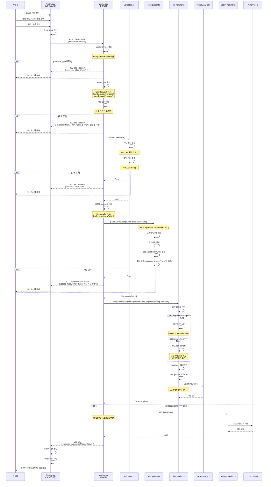

# 파일 업로드 (File Upload) 기능 상세 분석

**마지막 업데이트**: 2024-01-01

---

## 1. 기능 개요

### 목적

XLSX 파일을 업로드하여 대량의 단어를 일괄 추가하는 기능입니다. 파일 검증, 파싱, 중복 체크, 병합을 수행합니다.

### 사용자 시나리오

1. **시나리오 1: 병합 모드 업로드**
   - 사용자가 XLSX 파일 선택
   - "병합" 옵션 선택 (기존 데이터 유지)
   - 파일 업로드
   - 중복 체크 후 새 단어만 추가
   - 업로드 결과 표시 (추가된 개수, 중복된 개수)

2. **시나리오 2: 교체 모드 업로드**
   - 사용자가 XLSX 파일 선택
   - "교체" 옵션 선택 (기존 데이터 교체)
   - 파일 업로드
   - 기존 데이터를 새 데이터로 교체
   - 업로드 결과 표시

---

## 2. 구현 상세

### 관련 파일 전체 목록

#### UI 레이어

- **파일 관리 컴포넌트**:
  - `src/lib/components/VocabularyFileManager.svelte`
    - 파일 업로드 UI
    - 업로드 결과 표시

- **파일 업로드 컴포넌트**:
  - `src/lib/components/FileUpload.svelte`
    - 파일 선택 UI
    - 업로드 진행 상태 표시

#### API 레이어

- **업로드 API 엔드포인트**:
  - `src/routes/api/upload/+server.ts` (168줄)
    - `POST` 메소드 (12-148줄): 파일 업로드 처리
    - `GET` 메소드 (155-167줄): 업로드 정보 제공

#### DB/유틸리티 레이어

- **검증 유틸리티**:
  - `src/lib/utils/validation.ts`
    - `validateXlsxFile()` (파일 형식 및 크기 검증)

- **XLSX 파서**:
  - `src/lib/utils/xlsx-parser.ts` (833줄)
    - `parseXlsxToJson()` (XLSX → VocabularyEntry[])

- **파일 핸들러**:
  - `src/lib/utils/file-handler.ts`
    - `mergeVocabularyData()` (데이터 병합)

- **히스토리 핸들러**:
  - `src/lib/utils/history-handler.ts`
    - `addHistoryLog()` (히스토리 로그 추가)

- **타입 정의**:
  - `src/lib/types/vocabulary.ts`
    - `UploadResult` 인터페이스
    - `VocabularyEntry` 인터페이스

### 코드 구조

```
VocabularyFileManager.svelte
  └─ FileUpload 컴포넌트
      └─ 파일 선택 및 업로드
          └─ POST /api/upload 호출

/api/upload/+server.ts
  ├─ POST 메소드
  │   ├─ Content-Type 검증
  │   ├─ FormData 파싱
  │   ├─ 파일 존재 확인
  │   ├─ validateXlsxFile()
  │   ├─ 파일을 Buffer로 변환
  │   ├─ parseXlsxToJson()
  │   ├─ mergeVocabularyData()
  │   ├─ addHistoryLog() (병합 모드만)
  │   └─ 응답 반환
  │
  └─ GET 메소드
      └─ 업로드 정보 제공
```

---

## 3. 데이터 흐름

### 상세 시퀀스 다이어그램



### 각 단계별 사용 타입

| 단계          | 타입/인터페이스             | 파일 위치                     | 설명                |
| ------------- | --------------------------- | ----------------------------- | ------------------- |
| 파일 선택     | `File`                      | `FileUpload.svelte`           | 브라우저 File 객체  |
| FormData      | `FormData`                  | `+server.ts:28`               | multipart/form-data |
| 파일 검증     | `File`                      | `validation.ts`               | 형식 및 크기 검증   |
| 파일 버퍼     | `Buffer`                    | `+server.ts:59-60`            | Node.js Buffer      |
| 파싱 결과     | `VocabularyEntry[]`         | `xlsx-parser.ts`              | 파싱된 엔트리 배열  |
| 병합 결과     | `VocabularyData`            | `file-handler.ts`             | 최종 단어집 데이터  |
| 히스토리 로그 | `HistoryLogEntry`           | `history-handler.ts`          | 업로드 이력         |
| 응답 데이터   | `ApiResponse<UploadResult>` | `src/lib/types/vocabulary.ts` | 업로드 결과         |

### 타입 변환 지점

1. **File → FormData**
   - 위치: `FileUpload.svelte`
   - 변환: 브라우저 File 객체 → FormData

2. **FormData.get('file') → File**
   - 위치: `+server.ts:29`
   - 변환: `formData.get('file') as File`
   - ⚠️ 문제: null 체크 없이 타입 단언 (#C3)

3. **File → Buffer**
   - 위치: `+server.ts:59-60`
   - 변환: `file.arrayBuffer()` → `Buffer.from(arrayBuffer)`

4. **Buffer → VocabularyEntry[]**
   - 위치: `xlsx-parser.ts`
   - 변환: XLSX 바이너리 → 엔트리 배열

5. **VocabularyEntry[] → VocabularyData**
   - 위치: `file-handler.ts` (mergeVocabularyData)
   - 변환: 파싱된 배열 → 병합된 데이터 구조

---

## 4. 현재 구현 상태

### 작동하는 부분

✅ **정상 작동**:

- 파일 형식 검증 (.xlsx, .xls)
- 파일 크기 검증 (최대 10MB)
- XLSX 파일 파싱
- 중복 체크 (병합 모드)
- 데이터 병합 및 교체
- 히스토리 로그 기록 (병합 모드만)
- 업로드 결과 표시

### 작동하지 않는 부분

❌ **문제점**:

- 동시성 문제: 동시 업로드 시 데이터 손실 가능 (#C1)
- FormData null 체크 부족: 타입 단언 후 확인 (#C3)
- TODO 주석: 파일별 히스토리 초기화 미구현 (#L5)
- 런타임 타입 검증 없음: JSON 파싱 시 타입 단언만 사용 (#C2)

---

## 5. 발견된 문제점

### 버그

1. **FormData null 체크 부족 (#C3)**
   - **심각도**: Critical
   - **위치**: `+server.ts:29`
   - **문제**: `formData.get('file')` null 체크 없이 타입 단언 사용
   - **재현**: `file` 필드 없이 FormData 전송
   - **영향**: 런타임 에러 가능성

2. **동시성 문제 (#C1)**
   - **심각도**: Critical
   - **위치**: `file-handler.ts` (전체 파일)
   - **문제**: 동시 업로드 시 마지막 쓰기가 이전 변경사항을 덮어씀
   - **재현**: 두 사용자가 동시에 업로드
   - **영향**: 데이터 손실

### 개선 필요 사항

1. **TODO 주석 미구현 (#L5)**
   - **심각도**: Low Priority
   - **위치**: `+server.ts:96`
   - **문제**: 파일별 히스토리 초기화 로직 미구현
   - **영향**: 교체 모드에서 히스토리 관리 불완전

2. **에러 처리 개선**
   - **심각도**: Medium Priority
   - **위치**: `+server.ts:137-147`
   - **문제**: 일반적인 에러 메시지만 반환
   - **영향**: 디버깅 어려움

---

## 6. 개선 제안

### 수정 방향

#### 1. FormData null 체크 개선

**방향**: 타입 가드 사용

```typescript
// +server.ts
export async function POST({ request }: RequestEvent) {
  try {
    // Content-Type 확인
    const contentType = request.headers.get('content-type');
    if (!contentType?.includes('multipart/form-data')) {
      return json({
        success: false,
        error: '파일 업로드는 multipart/form-data 형식이어야 합니다.',
        message: 'Invalid content type'
      }, { status: 400 });
    }

    // FormData 파싱
    const formData = await request.formData();
    const fileValue = formData.get('file');

    // 타입 가드 사용
    if (!fileValue || !(fileValue instanceof File)) {
      return json({
        success: false,
        error: '업로드할 파일이 없습니다.',
        message: 'No file uploaded'
      }, { status: 400 });
    }

    const file = fileValue;
    const filename = (formData.get('filename') as string) || 'vocabulary.json';

    // ... 나머지 로직
  }
}
```

#### 2. 동시성 문제 해결

**방향**: 파일 락 메커니즘 도입 (vocabulary-create-detail.md 참고)

#### 3. 파일별 히스토리 초기화 구현

**방향**: 교체 모드에서 해당 파일의 히스토리만 초기화

```typescript
// +server.ts
if (replaceExisting) {
	// 파일별 히스토리 초기화
	try {
		await clearHistoryLog(filename, 'vocabulary');
	} catch (historyError) {
		console.warn('히스토리 초기화 실패:', historyError);
		// 히스토리 초기화 실패는 전체 업로드를 실패시키지 않음
	}

	// 교체 모드 히스토리 로그 추가
	await addHistoryLog({
		id: `upload_replace_${Date.now()}_${Math.random().toString(36).substr(2, 9)}`,
		action: 'UPLOAD_REPLACE',
		targetId: 'vocabulary_file',
		targetName: `${file.name} (${parsedEntries.length}개 단어)`,
		timestamp: new Date().toISOString(),
		filename: filename,
		details: {
			fileName: file.name,
			fileSize: file.size,
			processedCount: parsedEntries.length,
			replaceMode: true
		}
	});
}
```

### 코드 예시

**개선된 POST 핸들러**:

```typescript
export async function POST({ request }: RequestEvent) {
	try {
		// 1. Content-Type 검증
		const contentType = request.headers.get('content-type');
		if (!contentType?.includes('multipart/form-data')) {
			return json(
				{
					success: false,
					error: '파일 업로드는 multipart/form-data 형식이어야 합니다.',
					message: 'Invalid content type'
				},
				{ status: 400 }
			);
		}

		// 2. FormData 파싱 및 검증
		const formData = await request.formData();
		const fileValue = formData.get('file');

		if (!fileValue || !(fileValue instanceof File)) {
			return json(
				{
					success: false,
					error: '업로드할 파일이 없습니다.',
					message: 'No file uploaded'
				},
				{ status: 400 }
			);
		}

		const file = fileValue;
		const filename = (formData.get('filename') as string) || 'vocabulary.json';
		const replaceExisting = formData.get('replace') === 'true';

		// 3. 파일 검증
		try {
			validateXlsxFile(file);
		} catch (validationError) {
			return json(
				{
					success: false,
					error: validationError instanceof Error ? validationError.message : '파일 검증 실패',
					message: 'File validation failed'
				},
				{ status: 400 }
			);
		}

		// 4. 파일을 Buffer로 변환
		const arrayBuffer = await file.arrayBuffer();
		const buffer = Buffer.from(arrayBuffer);

		// 5. XLSX 파일 파싱
		let parsedEntries;
		try {
			parsedEntries = parseXlsxToJson(buffer, !replaceExisting);
		} catch (parseError) {
			return json(
				{
					success: false,
					error: parseError instanceof Error ? parseError.message : 'Excel 파일 파싱 실패',
					message: 'Excel parsing failed'
				},
				{ status: 422 }
			);
		}

		// 6. 데이터 병합 (파일 락 사용)
		const dataPath = getDataPath(filename, 'vocabulary');
		let finalData: VocabularyData;

		try {
			finalData = await withFileLock(dataPath, async () => {
				return await mergeVocabularyData(parsedEntries, replaceExisting, filename);
			});
		} catch (mergeError) {
			return json(
				{
					success: false,
					error: mergeError instanceof Error ? mergeError.message : '데이터 병합 실패',
					message: 'Data merge failed'
				},
				{ status: 500 }
			);
		}

		// 7. 히스토리 로그 처리
		if (replaceExisting) {
			// 교체 모드: 파일별 히스토리 초기화
			try {
				await clearHistoryLog(filename, 'vocabulary');
			} catch (historyError) {
				console.warn('히스토리 초기화 실패:', historyError);
			}

			// 교체 모드 히스토리 로그 추가
			await addHistoryLog({
				id: `upload_replace_${Date.now()}_${Math.random().toString(36).substr(2, 9)}`,
				action: 'UPLOAD_REPLACE',
				targetId: 'vocabulary_file',
				targetName: `${file.name} (${parsedEntries.length}개 단어)`,
				timestamp: new Date().toISOString(),
				filename: filename,
				details: {
					fileName: file.name,
					fileSize: file.size,
					processedCount: parsedEntries.length,
					replaceMode: true
				}
			});
		} else {
			// 병합 모드: 업로드 히스토리 로그 추가
			try {
				await addHistoryLog({
					id: `upload_merge_${Date.now()}_${Math.random().toString(36).substr(2, 9)}`,
					action: 'UPLOAD_MERGE',
					targetId: 'vocabulary_file',
					targetName: `${file.name} (${parsedEntries.length}개 단어)`,
					timestamp: new Date().toISOString(),
					filename: filename,
					details: {
						fileName: file.name,
						fileSize: file.size,
						processedCount: parsedEntries.length,
						replaceMode: false
					}
				});
			} catch (historyError) {
				console.warn('업로드 히스토리 로그 추가 실패:', historyError);
			}
		}

		// 8. 성공 응답
		const uploadResult: UploadResult = {
			success: true,
			message: `${parsedEntries.length}개의 단어가 성공적으로 처리되었습니다.`,
			data: finalData
		};

		return json(
			{
				success: true,
				data: uploadResult,
				message: 'Upload successful'
			},
			{ status: 200 }
		);
	} catch (error) {
		return handleApiError(error, '파일 업로드 처리 중 오류가 발생했습니다.');
	}
}
```

---

## 7. 테스트 시나리오

### 단위 테스트 케이스

#### 1. 파일 검증 테스트

```typescript
describe('POST /api/upload - 파일 검증', () => {
	it('XLSX 파일 업로드 성공', async () => {
		const formData = new FormData();
		formData.append(
			'file',
			new File(['test'], 'test.xlsx', {
				type: 'application/vnd.openxmlformats-officedocument.spreadsheetml.sheet'
			})
		);

		const response = await fetch('/api/upload', {
			method: 'POST',
			body: formData
		});

		expect(response.status).toBe(200);
	});

	it('잘못된 파일 형식 업로드 시 400 에러', async () => {
		const formData = new FormData();
		formData.append('file', new File(['test'], 'test.txt', { type: 'text/plain' }));

		const response = await fetch('/api/upload', {
			method: 'POST',
			body: formData
		});

		expect(response.status).toBe(400);
	});

	it('파일 없이 업로드 시 400 에러', async () => {
		const formData = new FormData();

		const response = await fetch('/api/upload', {
			method: 'POST',
			body: formData
		});

		expect(response.status).toBe(400);
	});
});
```

#### 2. 병합 모드 테스트

```typescript
describe('POST /api/upload - 병합 모드', () => {
	it('기존 데이터와 병합 성공', async () => {
		// 기존 데이터 준비
		await addVocabularyEntry({
			standardName: '기존단어',
			abbreviation: 'EXIST',
			englishName: 'Existing'
		});

		// 새 데이터 업로드
		const formData = new FormData();
		formData.append(
			'file',
			createTestXlsxFile([{ standardName: '새단어', abbreviation: 'NEW', englishName: 'New' }])
		);
		formData.append('replace', 'false');

		const response = await fetch('/api/upload', {
			method: 'POST',
			body: formData
		});

		const result = await response.json();
		expect(result.success).toBe(true);

		// 데이터 확인
		const vocabularyData = await loadVocabularyData();
		expect(vocabularyData.entries.length).toBe(2);
		expect(vocabularyData.entries.find((e) => e.abbreviation === 'EXIST')).toBeDefined();
		expect(vocabularyData.entries.find((e) => e.abbreviation === 'NEW')).toBeDefined();
	});
});
```

### 통합 테스트 시나리오

#### 1. 전체 업로드 플로우 테스트

```typescript
describe('파일 업로드 통합 테스트', () => {
	it('사용자가 파일을 업로드하면 데이터가 추가됨', async () => {
		await page.goto('/browse');

		// 파일 선택
		await page.setInputFiles('input[type="file"]', 'test.xlsx');

		// 업로드 버튼 클릭
		await page.click('button:has-text("업로드")');

		// 성공 메시지 확인
		await expect(page.locator('.success-message')).toBeVisible();

		// 테이블에 새 데이터 표시 확인
		await expect(page.locator('td:has-text("새단어")')).toBeVisible();
	});
});
```

---

**마지막 업데이트**: 2024-01-01
