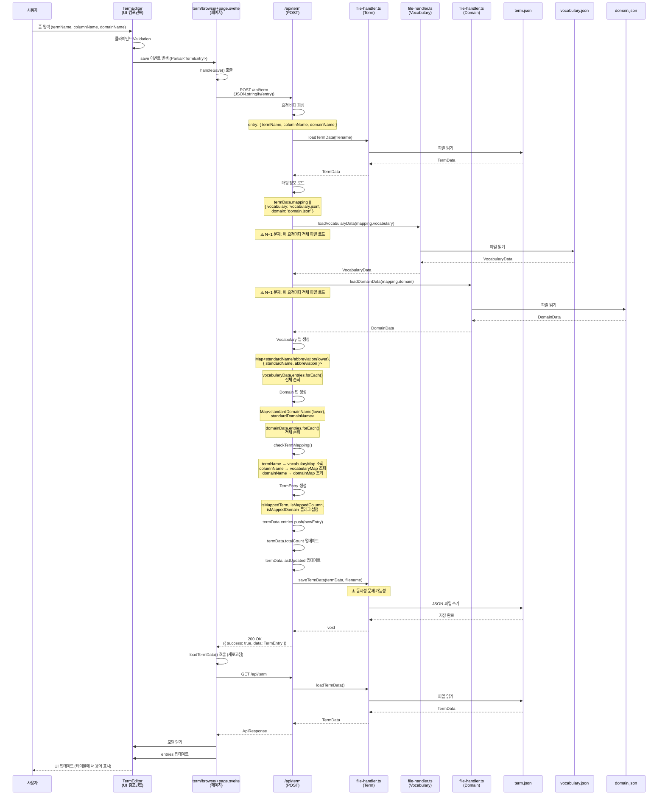

# 용어 추가 (Term Create) 기능 상세 분석

**마지막 업데이트**: 2024-01-01

---

## 1. 기능 개요

### 목적

새로운 용어를 추가하고 매핑 검증을 수행하는 기능입니다. 용어명, 칼럼명, 도메인명이 각각 vocabulary, domain과 매핑되는지 검증합니다.

### 사용자 시나리오

1. **시나리오 1: 정상 추가 (모든 매핑 성공)**
   - 사용자가 용어 관리 페이지에서 "용어 추가" 버튼 클릭
   - `TermEditor` 모달이 열림
   - 용어명, 칼럼명, 도메인명 입력
   - "저장" 버튼 클릭
   - 매핑 검증 성공 (용어명 → vocabulary, 칼럼명 → vocabulary, 도메인명 → domain)
   - 용어가 추가되고 테이블에 표시됨

2. **시나리오 2: 부분 매핑**
   - 사용자가 용어 추가 시도
   - 용어명은 vocabulary에 매핑되지만, 칼럼명은 매핑되지 않음
   - 용어는 추가되지만 `isMappedColumn: false`로 표시

3. **시나리오 3: 매핑 실패**
   - 사용자가 존재하지 않는 용어명/칼럼명/도메인명 입력
   - 용어는 추가되지만 모든 매핑 플래그가 `false`

---

## 2. 구현 상세

### 관련 파일 전체 목록

#### UI 레이어

- **페이지 컴포넌트**:
  - `src/routes/term/browse/+page.svelte` (944줄)
    - 용어 추가 버튼 및 이벤트 핸들러
    - `handleSave()` 함수 (용어 저장 로직)

- **편집 컴포넌트**:
  - `src/lib/components/TermEditor.svelte` (668줄)
    - 폼 입력 필드 (용어명, 칼럼명, 도메인명)
    - 자동완성 제안
    - 매핑 정보 표시

#### API 레이어

- **API 엔드포인트**:
  - `src/routes/api/term/+server.ts` (469줄)
    - `POST` 메소드 (220-305줄)
    - 매핑 정보 로드
    - Vocabulary/Domain 데이터 로드
    - 매핑 검증
    - 용어 저장

#### DB/유틸리티 레이어

- **파일 핸들러**:
  - `src/lib/utils/file-handler.ts`
    - `loadTermData()` (867-928줄)
    - `saveTermData()` (933-972줄)
    - `loadVocabularyData()` (208-283줄)
    - `loadDomainData()` (574-619줄)

- **매핑 검증**:
  - `src/routes/api/term/+server.ts`
    - `checkTermMapping()` 함수 (매핑 검증 로직)

- **타입 정의**:
  - `src/lib/types/term.ts`
    - `TermEntry` 인터페이스
    - `TermData` 인터페이스
  - `src/lib/types/vocabulary.ts`
    - `VocabularyEntry` 인터페이스
  - `src/lib/types/domain.ts`
    - `DomainEntry` 인터페이스

### 코드 구조

```
term/browse/+page.svelte
  ├─ handleSave() 함수
  │   ├─ POST /api/term 호출
  │   └─ loadTermData() 호출 (새로고침)
  │
  └─ TermEditor 컴포넌트
      ├─ 폼 입력 필드
      ├─ 자동완성 제안
      └─ save 이벤트 발생

/api/term/+server.ts (POST)
  ├─ 요청 바디 파싱
  ├─ loadTermData()
  ├─ 매핑 정보 로드
  ├─ loadVocabularyData() ⚠️ N+1 문제
  ├─ loadDomainData() ⚠️ N+1 문제
  ├─ Vocabulary 맵 생성
  ├─ Domain 맵 생성
  ├─ checkTermMapping()
  ├─ TermEntry 생성
  ├─ saveTermData()
  └─ 응답 반환
```

---

## 3. 데이터 흐름

### 상세 시퀀스 다이어그램



### 각 단계별 사용 타입

| 단계          | 타입/인터페이스                               | 파일 위치                 | 설명                                               |
| ------------- | --------------------------------------------- | ------------------------- | -------------------------------------------------- |
| 사용자 입력   | `Partial<TermEntry>`                          | `TermEditor.svelte`       | 폼 입력 데이터                                     |
| API 요청      | `Partial<TermEntry>`                          | `+server.ts:223`          | JSON 파싱 결과                                     |
| 용어 데이터   | `TermData`                                    | `file-handler.ts:867-928` | 전체 용어 데이터                                   |
| 매핑 정보     | `TermData.mapping`                            | `+server.ts:232-235`      | `{ vocabulary, domain }`                           |
| 단어집 데이터 | `VocabularyData`                              | `file-handler.ts:208-283` | 전체 단어집 데이터                                 |
| 도메인 데이터 | `DomainData`                                  | `file-handler.ts:574-619` | 전체 도메인 데이터                                 |
| Vocabulary 맵 | `Map<string, { standardName, abbreviation }>` | `+server.ts:242-254`      | 검색용 맵                                          |
| Domain 맵     | `Map<string, string>`                         | `+server.ts:257-261`      | 검색용 맵                                          |
| 매핑 결과     | `MappingResult`                               | `+server.ts:264-270`      | `{ isMappedTerm, isMappedColumn, isMappedDomain }` |
| 용어 엔트리   | `TermEntry`                                   | `+server.ts:272-282`      | 생성된 용어 엔트리                                 |
| 응답 데이터   | `ApiResponse<TermEntry>`                      | `src/lib/types/term.ts`   | 성공 응답                                          |

### 타입 변환 지점

1. **폼 입력 → Partial<TermEntry>**
   - 위치: `TermEditor.svelte`
   - 변환: 사용자 입력 문자열 → 객체

2. **JSON 파싱 → Partial<TermEntry>**
   - 위치: `+server.ts:223`
   - 변환: `await request.json()` → 타입 단언
   - ⚠️ 문제: 런타임 검증 없음

3. **VocabularyEntry[] → Map**
   - 위치: `+server.ts:242-254`
   - 변환: 배열 → 검색용 맵 (표준단어명/영문약어 → 엔트리 정보)

4. **DomainEntry[] → Map**
   - 위치: `+server.ts:257-261`
   - 변환: 배열 → 검색용 맵 (표준도메인명 → 표준도메인명)

5. **Partial<TermEntry> → TermEntry**
   - 위치: `+server.ts:272-282`
   - 변환: 필수 필드 보완, UUID 생성, 매핑 플래그 설정

---

## 4. 현재 구현 상태

### 작동하는 부분

✅ **정상 작동**:

- 용어 추가
- 매핑 정보 로드
- Vocabulary/Domain 데이터 로드
- 매핑 검증 (용어명, 칼럼명, 도메인명)
- 매핑 플래그 설정 (`isMappedTerm`, `isMappedColumn`, `isMappedDomain`)
- JSON 파일 저장
- UI 업데이트

### 작동하지 않는 부분

❌ **문제점**:

- N+1 문제: 매 요청마다 Vocabulary/Domain 전체 파일 로드 (#H3)
- 동시성 문제: 동시 추가 시 데이터 손실 가능 (#C1)
- 런타임 타입 검증 없음: JSON 파싱 시 타입 단언만 사용 (#C2)

---

## 5. 발견된 문제점

### 버그

1. **N+1 문제 (#H3)**
   - **심각도**: High Priority
   - **위치**: `+server.ts:238-239`
   - **문제**: 매 요청마다 Vocabulary/Domain 전체 파일 로드
   - **재현**: 용어 100개 추가 시 100번 파일 로드
   - **영향**: 대용량 데이터에서 성능 저하

2. **동시성 문제 (#C1)**
   - **심각도**: Critical
   - **위치**: `file-handler.ts` (전체 파일)
   - **문제**: 동시 추가 시 마지막 쓰기가 이전 변경사항을 덮어씀
   - **재현**: 두 사용자가 동시에 용어 추가
   - **영향**: 데이터 손실

### 개선 필요 사항

1. **캐싱 메커니즘 부재**
   - **심각도**: High Priority
   - **위치**: `+server.ts:238-239`
   - **문제**: Vocabulary/Domain 데이터를 매번 로드
   - **영향**: 불필요한 I/O 작업
   - **개선**: 메모리 캐시 또는 인덱스 파일

2. **매핑 검증 로직 최적화**
   - **심각도**: Medium Priority
   - **위치**: `+server.ts:242-261`
   - **문제**: 전체 엔트리를 순회하며 맵 생성
   - **영향**: 대용량 데이터에서 성능 저하
   - **개선**: 인덱스 기반 검색

---

## 6. 개선 제안

### 수정 방향

#### 1. N+1 문제 해결: 캐싱 메커니즘 도입

**방향**: Vocabulary/Domain 데이터를 메모리 캐시에 저장

```typescript
// src/lib/utils/mapping-cache.ts (신규 생성)
import { LRUCache } from 'lru-cache';

const vocabularyCache = new LRUCache<
	string,
	{
		data: VocabularyData;
		map: Map<string, { standardName: string; abbreviation: string }>;
		lastUpdated: string;
	}
>({
	max: 10, // 최대 10개 파일 캐싱
	ttl: 5 * 60 * 1000 // 5분 TTL
});

const domainCache = new LRUCache<
	string,
	{
		data: DomainData;
		map: Map<string, string>;
		lastUpdated: string;
	}
>({
	max: 10,
	ttl: 5 * 60 * 1000
});

export async function getVocabularyMap(
	filename: string
): Promise<Map<string, { standardName: string; abbreviation: string }>> {
	// 캐시 확인
	const cached = vocabularyCache.get(filename);
	if (cached) {
		const vocabularyData = await loadVocabularyData(filename);
		if (cached.lastUpdated === vocabularyData.lastUpdated) {
			return cached.map;
		}
	}

	// 데이터 로드 및 맵 생성
	const vocabularyData = await loadVocabularyData(filename);
	const vocabularyMap = new Map<string, { standardName: string; abbreviation: string }>();

	vocabularyData.entries.forEach((vocabEntry) => {
		const standardNameKey = vocabEntry.standardName.trim().toLowerCase();
		const abbreviationKey = vocabEntry.abbreviation.trim().toLowerCase();
		vocabularyMap.set(standardNameKey, {
			standardName: vocabEntry.standardName,
			abbreviation: vocabEntry.abbreviation
		});
		vocabularyMap.set(abbreviationKey, {
			standardName: vocabEntry.standardName,
			abbreviation: vocabEntry.abbreviation
		});
	});

	// 캐시 저장
	vocabularyCache.set(filename, {
		data: vocabularyData,
		map: vocabularyMap,
		lastUpdated: vocabularyData.lastUpdated
	});

	return vocabularyMap;
}

export async function getDomainMap(filename: string): Promise<Map<string, string>> {
	// 유사한 로직
	// ...
}
```

**적용**:

```typescript
// +server.ts
export async function POST({ request }: RequestEvent) {
  try {
    const body = await request.json();
    const { entry, filename = 'term.json' } = body;

    // 용어 데이터 로드
    const termData = await loadTermData(filename);

    // 매핑 정보 로드
    const mapping = termData.mapping || {
      vocabulary: 'vocabulary.json',
      domain: 'domain.json'
    };

    // 캐시된 맵 사용 (N+1 문제 해결)
    const [vocabularyMap, domainMap] = await Promise.all([
      getVocabularyMap(mapping.vocabulary),
      getDomainMap(mapping.domain)
    ]);

    // 매핑 검증
    const mappingResult = checkTermMapping(
      entry.termName.trim(),
      entry.columnName.trim(),
      entry.domainName.trim(),
      vocabularyMap,
      domainMap
    );

    // ... 나머지 로직
  }
}
```

#### 2. 동시성 문제 해결

**방향**: 파일 락 메커니즘 도입 (vocabulary-create-detail.md 참고)

### 코드 예시

**개선된 POST 핸들러**:

```typescript
export async function POST({ request }: RequestEvent) {
	try {
		const body = await request.json();
		const { entry, filename = 'term.json' } = body;

		if (!entry || !entry.termName || !entry.columnName || !entry.domainName) {
			return json(
				{
					success: false,
					error: '용어명, 칼럼명, 도메인명은 필수 항목입니다.',
					message: 'Missing required fields'
				},
				{ status: 400 }
			);
		}

		// 용어 데이터 로드
		const termData = await loadTermData(filename);

		// 매핑 정보 로드
		const mapping = termData.mapping || {
			vocabulary: 'vocabulary.json',
			domain: 'domain.json'
		};

		// 캐시된 맵 사용 (N+1 문제 해결)
		const [vocabularyMap, domainMap] = await Promise.all([
			getVocabularyMap(mapping.vocabulary),
			getDomainMap(mapping.domain)
		]);

		// 매핑 검증
		const mappingResult = checkTermMapping(
			entry.termName.trim(),
			entry.columnName.trim(),
			entry.domainName.trim(),
			vocabularyMap,
			domainMap
		);

		// 용어 엔트리 생성
		const newEntry: TermEntry = {
			id: entry.id || crypto.randomUUID(),
			termName: entry.termName.trim(),
			columnName: entry.columnName.trim(),
			domainName: entry.domainName.trim(),
			isMappedTerm: mappingResult.isMappedTerm,
			isMappedColumn: mappingResult.isMappedColumn,
			isMappedDomain: mappingResult.isMappedDomain,
			createdAt: entry.createdAt || new Date().toISOString(),
			updatedAt: new Date().toISOString()
		};

		// 파일 락을 사용한 안전한 저장
		const dataPath = getDataPath(filename, 'term');
		await withFileLock(dataPath, async () => {
			const termData = await loadTermData(filename);
			termData.entries.push(newEntry);
			termData.totalCount = termData.entries.length;
			termData.lastUpdated = new Date().toISOString();
			await saveTermData(termData, filename);
		});

		return json(
			{
				success: true,
				data: newEntry,
				message: 'Term added successfully'
			},
			{ status: 200 }
		);
	} catch (error) {
		return handleApiError(error, '용어 추가 중 오류가 발생했습니다.');
	}
}
```

---

## 7. 테스트 시나리오

### 단위 테스트 케이스

#### 1. 매핑 검증 테스트

```typescript
describe('POST /api/term - 매핑 검증', () => {
	it('모든 매핑 성공 시 플래그 모두 true', async () => {
		// Vocabulary 데이터 준비
		await addVocabularyEntry({
			standardName: '테스트',
			abbreviation: 'TEST',
			englishName: 'Test'
		});

		// Domain 데이터 준비
		await addDomainEntry({
			standardDomainName: '테스트도메인'
		});

		// 용어 추가
		const response = await fetch('/api/term', {
			method: 'POST',
			body: JSON.stringify({
				entry: {
					termName: '테스트',
					columnName: 'TEST',
					domainName: '테스트도메인'
				}
			})
		});

		const result = await response.json();
		expect(result.success).toBe(true);
		expect(result.data.isMappedTerm).toBe(true);
		expect(result.data.isMappedColumn).toBe(true);
		expect(result.data.isMappedDomain).toBe(true);
	});

	it('매핑 실패 시 플래그 false', async () => {
		const response = await fetch('/api/term', {
			method: 'POST',
			body: JSON.stringify({
				entry: {
					termName: '존재하지않음',
					columnName: 'NOTEXIST',
					domainName: '존재하지않는도메인'
				}
			})
		});

		const result = await response.json();
		expect(result.success).toBe(true);
		expect(result.data.isMappedTerm).toBe(false);
		expect(result.data.isMappedColumn).toBe(false);
		expect(result.data.isMappedDomain).toBe(false);
	});
});
```

#### 2. N+1 문제 해결 테스트

```typescript
describe('POST /api/term - N+1 문제 해결', () => {
	it('캐시를 사용하여 파일 로드 횟수 감소', async () => {
		// 파일 로드 횟수 추적
		let loadCount = 0;
		const originalLoad = loadVocabularyData;
		loadVocabularyData = async (filename: string) => {
			loadCount++;
			return originalLoad(filename);
		};

		// 용어 10개 추가
		for (let i = 0; i < 10; i++) {
			await fetch('/api/term', {
				method: 'POST',
				body: JSON.stringify({
					entry: {
						termName: `테스트${i}`,
						columnName: `TEST${i}`,
						domainName: '테스트도메인'
					}
				})
			});
		}

		// 캐시 사용 시 파일 로드 횟수는 1회 (또는 적은 횟수)
		expect(loadCount).toBeLessThan(10);

		// 원래 함수 복원
		loadVocabularyData = originalLoad;
	});
});
```

### 통합 테스트 시나리오

#### 1. 전체 용어 추가 플로우 테스트

```typescript
describe('용어 추가 통합 테스트', () => {
	it('사용자가 용어를 추가하면 UI에 반영됨', async () => {
		await page.goto('/term/browse');

		// 용어 추가 버튼 클릭
		await page.click('button:has-text("용어 추가")');

		// 폼 입력
		await page.fill('input[name="termName"]', '테스트');
		await page.fill('input[name="columnName"]', 'TEST');
		await page.fill('input[name="domainName"]', '테스트도메인');

		// 저장 버튼 클릭
		await page.click('button:has-text("저장")');

		// 성공 메시지 확인
		await expect(page.locator('.success-message')).toBeVisible();

		// 테이블에 새 용어 표시 확인
		await expect(page.locator('td:has-text("테스트")')).toBeVisible();
	});
});
```

---

**마지막 업데이트**: 2024-01-01
