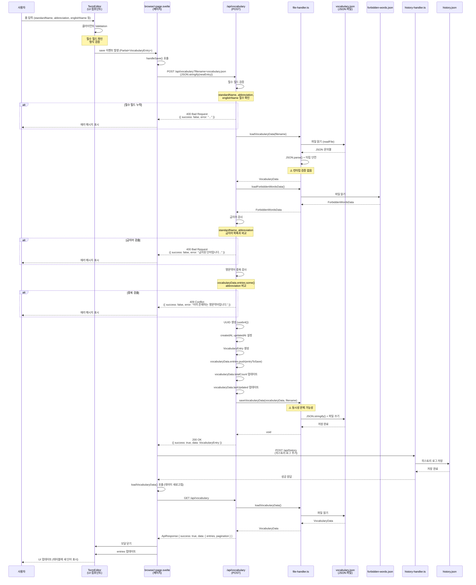

# 단어 추가 (Vocabulary Create) 기능 상세 분석

**마지막 업데이트**: 2024-01-01

---

## 1. 기능 개요

### 목적

사용자가 새로운 단어를 단어집에 추가하는 핵심 기능입니다. 필수 필드 검증, 금지어 검사, 중복 검사를 수행한 후 JSON 파일에 저장합니다.

### 사용자 시나리오

1. **시나리오 1: 정상 추가**
   - 사용자가 단어집 관리 페이지(`/browse`)에서 "단어 추가" 버튼 클릭
   - `TermEditor` 모달이 열림
   - 표준단어명, 영문약어, 영문명 입력 (필수)
   - 설명, 도메인 분류명 등 선택 필드 입력
   - "저장" 버튼 클릭
   - 검증 통과 후 단어가 추가되고 테이블에 표시됨

2. **시나리오 2: 금지어 검사 실패**
   - 사용자가 금지어 목록에 있는 단어를 입력
   - 저장 시도 시 "금지된 단어입니다. 사유: ..." 에러 메시지 표시
   - 저장 실패

3. **시나리오 3: 중복 검사 실패**
   - 사용자가 이미 존재하는 영문약어를 입력
   - 저장 시도 시 "이미 존재하는 영문약어입니다." 에러 메시지 표시
   - 저장 실패

---

## 2. 구현 상세

### 관련 파일 전체 목록

#### UI 레이어

- **페이지 컴포넌트**:
  - `src/routes/browse/+page.svelte` (1166줄)
    - 단어 추가 버튼 및 이벤트 핸들러
    - `handleSave()` 함수 (단어 저장 로직)
    - `loadVocabularyData()` 함수 (데이터 새로고침)

- **편집 컴포넌트**:
  - `src/lib/components/TermEditor.svelte` (668줄)
    - 폼 입력 필드 (표준단어명, 영문약어, 영문명 등)
    - 클라이언트 측 Validation
    - `save` 이벤트 발생

#### API 레이어

- **API 엔드포인트**:
  - `src/routes/api/vocabulary/+server.ts` (430줄)
    - `POST` 메소드 (191-304줄)
    - 필수 필드 검증
    - 금지어 검사
    - 중복 검사
    - UUID 생성
    - 데이터 저장

#### DB/유틸리티 레이어

- **파일 핸들러**:
  - `src/lib/utils/file-handler.ts` (1176줄)
    - `loadVocabularyData()` (208-283줄)
    - `saveVocabularyData()` (159-202줄)
    - `loadForbiddenWordsData()` (285-350줄)

- **히스토리 핸들러**:
  - `src/lib/utils/history-handler.ts`
    - `addHistoryLog()` (히스토리 로그 추가)

- **타입 정의**:
  - `src/lib/types/vocabulary.ts`
    - `VocabularyEntry` 인터페이스
    - `VocabularyData` 인터페이스
    - `ApiResponse` 인터페이스
    - `ForbiddenWordEntry` 인터페이스

### 코드 구조

```
browse/+page.svelte
  ├─ handleSave() 함수
  │   ├─ POST /api/vocabulary 호출
  │   ├─ 성공 시 POST /api/history 호출
  │   └─ loadVocabularyData() 호출 (새로고침)
  │
  └─ TermEditor 컴포넌트
      ├─ 폼 입력 필드
      ├─ 클라이언트 Validation
      └─ save 이벤트 발생

/api/vocabulary/+server.ts (POST)
  ├─ 필수 필드 검증
  ├─ loadVocabularyData()
  ├─ loadForbiddenWordsData()
  ├─ 금지어 검사
  ├─ 중복 검사
  ├─ UUID 생성
  ├─ VocabularyEntry 생성
  ├─ saveVocabularyData()
  └─ 응답 반환
```

---

## 3. 데이터 흐름

### 상세 시퀀스 다이어그램



### 각 단계별 사용 타입

| 단계                  | 타입/인터페이스                | 파일 위치                                  | 설명                  |
| --------------------- | ------------------------------ | ------------------------------------------ | --------------------- |
| 사용자 입력           | `Partial<VocabularyEntry>`     | `src/lib/types/vocabulary.ts`              | 폼 입력 데이터        |
| 클라이언트 Validation | -                              | `TermEditor.svelte`                        | 필수 필드 확인        |
| API 요청              | `Partial<VocabularyEntry>`     | `src/routes/api/vocabulary/+server.ts:193` | JSON 파싱 결과        |
| 필수 필드 검증        | -                              | `+server.ts:197-206`                       | 런타임 검증           |
| 데이터 로드           | `VocabularyData`               | `file-handler.ts:208-283`                  | JSON 파싱 + 타입 단언 |
| 금지어 데이터         | `ForbiddenWordsData`           | `file-handler.ts:285-350`                  | 금지어 목록           |
| 금지어 검사           | `ForbiddenWordEntry`           | `+server.ts:214-256`                       | 키워드 비교           |
| 중복 검사             | `VocabularyEntry[]`            | `+server.ts:262-274`                       | 배열 검색             |
| 엔트리 생성           | `VocabularyEntry`              | `+server.ts:276-287`                       | UUID, 타임스탬프 추가 |
| 데이터 저장           | `VocabularyData`               | `file-handler.ts:159-202`                  | JSON 파일 쓰기        |
| API 응답              | `ApiResponse<VocabularyEntry>` | `src/lib/types/vocabulary.ts`              | 성공 응답             |
| 히스토리 로그         | `HistoryLogEntry`              | `history-handler.ts`                       | 변경 이력 기록        |

### 타입 변환 지점

1. **폼 입력 → Partial<VocabularyEntry>**
   - 위치: `TermEditor.svelte`
   - 변환: 사용자 입력 문자열 → 객체

2. **JSON 파싱 → Partial<VocabularyEntry>**
   - 위치: `+server.ts:193`
   - 변환: `await request.json()` → 타입 단언
   - ⚠️ 문제: 런타임 검증 없음

3. **JSON 파싱 → VocabularyData**
   - 위치: `file-handler.ts:233`
   - 변환: `JSON.parse(jsonString) as VocabularyData`
   - ⚠️ 문제: 런타임 검증 없음

4. **Partial<VocabularyEntry> → VocabularyEntry**
   - 위치: `+server.ts:276-287`
   - 변환: 필수 필드 보완, UUID 생성, 타임스탬프 추가

---

## 4. 현재 구현 상태

### 작동하는 부분

✅ **정상 작동**:

- 필수 필드 검증 (표준단어명, 영문약어, 영문명)
- 금지어 검사 (표준단어명, 영문약어)
- 영문약어 중복 검사
- UUID 생성 및 타임스탬프 설정
- JSON 파일 저장
- 히스토리 로그 기록
- UI 업데이트 (테이블 새로고침)

### 작동하지 않는 부분

❌ **문제점**:

- 동시성 문제: 두 사용자가 동시에 추가 시 데이터 손실 가능
- 런타임 타입 검증 없음: 손상된 JSON 파일 로드 시 크래시 가능
- 부분 업데이트 시 `undefined` 값 처리 미흡 (현재는 문제 없지만 PUT에서 문제)
- 파일 쓰기 실패 시 롤백 없음

---

## 5. 발견된 문제점

### 버그

1. **동시성 문제 (#C1)**
   - **심각도**: Critical
   - **위치**: `file-handler.ts` (전체 파일)
   - **문제**: 두 사용자가 동시에 단어 추가 시 마지막 쓰기가 이전 변경사항을 덮어씀
   - **재현**: 두 브라우저 탭에서 동시에 단어 추가
   - **영향**: 데이터 손실

2. **런타임 타입 검증 없음 (#C2)**
   - **심각도**: Critical
   - **위치**: `file-handler.ts:233`, `+server.ts:193`
   - **문제**: JSON 파싱 결과에 타입 단언만 사용, 런타임 검증 없음
   - **재현**: `vocabulary.json` 파일을 수동으로 손상시킨 후 로드
   - **영향**: 런타임 크래시 가능성

3. **FormData null 체크 부족 (#C3)**
   - **심각도**: Critical (파일 업로드에서 발생, 단어 추가에서는 해당 없음)
   - **위치**: `+server.ts:29` (업로드 API)
   - **문제**: `formData.get('file')` null 체크 없이 타입 단언 사용

### 개선 필요 사항

1. **데이터 검증 로직 부족 (#H4)**
   - **심각도**: High Priority
   - **위치**: `+server.ts:197-206`
   - **문제**: 필수 필드만 검증, 타입/형식/길이 검증 부족
   - **개선**: Zod 또는 유사 라이브러리로 스키마 검증

2. **에러 처리 일관성 부족 (#H6)**
   - **심각도**: High Priority
   - **위치**: `+server.ts` (전체)
   - **문제**: 에러 메시지 형식이 일관되지 않음
   - **개선**: 공통 에러 핸들러 유틸리티 도입

3. **성능 최적화 (#H7)**
   - **심각도**: High Priority
   - **위치**: `file-handler.ts:208-283`
   - **문제**: 전체 파일을 메모리로 로드
   - **개선**: 인덱스 파일 또는 스트리밍 처리

---

## 6. 개선 제안

### 수정 방향

#### 1. 동시성 문제 해결

**방향**: 파일 락 메커니즘 도입

```typescript
// src/lib/utils/file-lock.ts (신규 생성)
import lockfile from 'proper-lockfile';

export async function withFileLock<T>(filePath: string, operation: () => Promise<T>): Promise<T> {
	const release = await lockfile.lock(filePath, {
		retries: {
			retries: 10,
			minTimeout: 100,
			maxTimeout: 1000
		}
	});

	try {
		return await operation();
	} finally {
		await release();
	}
}
```

**적용**:

```typescript
// file-handler.ts
export async function saveVocabularyData(
	data: VocabularyData,
	filename: string = DEFAULT_VOCABULARY_FILE
): Promise<void> {
	const dataPath = getDataPath(filename, 'vocabulary');

	await withFileLock(dataPath, async () => {
		// 원자적 쓰기 패턴
		const tempPath = `${dataPath}.tmp`;
		await writeFile(tempPath, JSON.stringify(data, null, 2), 'utf-8');
		await rename(tempPath, dataPath);
	});
}
```

#### 2. 런타임 타입 검증 추가

**방향**: 타입 가드 함수 구현

```typescript
// src/lib/utils/type-guards.ts (신규 생성)
export function isVocabularyEntry(obj: unknown): obj is VocabularyEntry {
	return (
		typeof obj === 'object' &&
		obj !== null &&
		'id' in obj &&
		typeof (obj as any).id === 'string' &&
		'standardName' in obj &&
		typeof (obj as any).standardName === 'string' &&
		'abbreviation' in obj &&
		typeof (obj as any).abbreviation === 'string' &&
		'englishName' in obj &&
		typeof (obj as any).englishName === 'string' &&
		'description' in obj &&
		typeof (obj as any).description === 'string' &&
		'createdAt' in obj &&
		typeof (obj as any).createdAt === 'string' &&
		'updatedAt' in obj &&
		typeof (obj as any).updatedAt === 'string'
	);
}

export function isVocabularyData(obj: unknown): obj is VocabularyData {
	return (
		typeof obj === 'object' &&
		obj !== null &&
		'entries' in obj &&
		Array.isArray((obj as any).entries) &&
		(obj as any).entries.every((entry: unknown) => isVocabularyEntry(entry)) &&
		'lastUpdated' in obj &&
		typeof (obj as any).lastUpdated === 'string' &&
		'totalCount' in obj &&
		typeof (obj as any).totalCount === 'number'
	);
}
```

**적용**:

```typescript
// file-handler.ts
export async function loadVocabularyData(
	filename: string = DEFAULT_VOCABULARY_FILE
): Promise<VocabularyData> {
	// ... 파일 읽기 ...
	const parsed = JSON.parse(jsonString);

	if (!isVocabularyData(parsed)) {
		throw new Error('Invalid vocabulary data format');
	}

	return parsed;
}
```

#### 3. 데이터 검증 강화

**방향**: Zod 스키마 도입

```typescript
// src/lib/schemas/vocabulary.ts (신규 생성)
import { z } from 'zod';

export const VocabularyEntrySchema = z.object({
	id: z.string().uuid(),
	standardName: z.string().min(1).max(200),
	abbreviation: z
		.string()
		.min(1)
		.max(50)
		.regex(/^[A-Za-z0-9_]+$/),
	englishName: z.string().min(1).max(200),
	description: z.string().max(1000).optional()
	// ... 나머지 필드
});

export const VocabularyDataSchema = z.object({
	entries: z.array(VocabularyEntrySchema),
	lastUpdated: z.string().datetime(),
	totalCount: z.number().int().nonnegative()
	// ... 나머지 필드
});
```

**적용**:

```typescript
// +server.ts
export async function POST({ request, url }: RequestEvent) {
	const body = await request.json();
	const parseResult = VocabularyEntrySchema.partial().safeParse(body);

	if (!parseResult.success) {
		return json(
			{
				success: false,
				error: parseResult.error.errors.map((e) => e.message).join(', '),
				message: 'Validation failed'
			},
			{ status: 400 }
		);
	}

	// ... 나머지 로직
}
```

### 코드 예시

**개선된 POST 핸들러**:

```typescript
export async function POST({ request, url }: RequestEvent) {
	try {
		// 1. 요청 바디 파싱 및 검증
		const body = await request.json();
		const parseResult = VocabularyEntrySchema.partial().safeParse(body);

		if (!parseResult.success) {
			return json(
				{
					success: false,
					error: parseResult.error.errors.map((e) => e.message).join(', '),
					message: 'Validation failed'
				},
				{ status: 400 }
			);
		}

		const newEntry = parseResult.data;
		const filename = url.searchParams.get('filename') || undefined;

		// 2. 필수 필드 검증
		if (!newEntry.standardName || !newEntry.abbreviation || !newEntry.englishName) {
			return json(
				{
					success: false,
					error: '표준단어명, 영문약어, 영문명은 필수 항목입니다.',
					message: 'Missing required fields'
				},
				{ status: 400 }
			);
		}

		// 3. 파일 락을 사용한 안전한 데이터 로드 및 저장
		const dataPath = getDataPath(filename || DEFAULT_VOCABULARY_FILE, 'vocabulary');

		const vocabularyData = await withFileLock(dataPath, async () => {
			const data = await loadVocabularyData(filename);

			// 4. 금지어 검사
			const forbiddenWordsData = await loadForbiddenWordsData();
			// ... 금지어 검사 로직 ...

			// 5. 중복 검사
			const isAbbreviationDuplicate = data.entries.some(
				(e) => e.abbreviation === newEntry.abbreviation
			);
			if (isAbbreviationDuplicate) {
				throw new Error('이미 존재하는 영문약어입니다.');
			}

			// 6. 엔트리 생성
			const entryToSave: VocabularyEntry = {
				id: uuidv4(),
				standardName: newEntry.standardName,
				abbreviation: newEntry.abbreviation,
				englishName: newEntry.englishName,
				description: newEntry.description || '',
				createdAt: new Date().toISOString(),
				updatedAt: new Date().toISOString()
			};

			// 7. 데이터 업데이트
			data.entries.push(entryToSave);
			data.totalCount = data.entries.length;
			data.lastUpdated = new Date().toISOString();

			// 8. 원자적 저장
			await saveVocabularyData(data, filename);

			return { data, entryToSave };
		});

		return json(
			{
				success: true,
				data: vocabularyData.entryToSave,
				message: '단어가 성공적으로 추가되었습니다.'
			},
			{ status: 200 }
		);
	} catch (error) {
		return handleApiError(error, '단어 추가 중 오류가 발생했습니다.');
	}
}
```

---

## 7. 테스트 시나리오

### 단위 테스트 케이스

#### 1. 필수 필드 검증 테스트

```typescript
describe('POST /api/vocabulary - 필수 필드 검증', () => {
	it('표준단어명 누락 시 400 에러 반환', async () => {
		const response = await fetch('/api/vocabulary', {
			method: 'POST',
			body: JSON.stringify({
				abbreviation: 'TEST',
				englishName: 'Test'
			})
		});

		expect(response.status).toBe(400);
		const result = await response.json();
		expect(result.success).toBe(false);
		expect(result.error).toContain('표준단어명');
	});

	it('영문약어 누락 시 400 에러 반환', async () => {
		// ... 유사한 테스트
	});

	it('영문명 누락 시 400 에러 반환', async () => {
		// ... 유사한 테스트
	});
});
```

#### 2. 금지어 검사 테스트

```typescript
describe('POST /api/vocabulary - 금지어 검사', () => {
	it('금지어 입력 시 400 에러 반환', async () => {
		// 금지어 목록에 '금지어' 추가
		await addForbiddenWord({ keyword: '금지어', type: 'standardName' });

		const response = await fetch('/api/vocabulary', {
			method: 'POST',
			body: JSON.stringify({
				standardName: '금지어',
				abbreviation: 'TEST',
				englishName: 'Test'
			})
		});

		expect(response.status).toBe(400);
		const result = await response.json();
		expect(result.success).toBe(false);
		expect(result.error).toContain('금지된 단어');
	});
});
```

#### 3. 중복 검사 테스트

```typescript
describe('POST /api/vocabulary - 중복 검사', () => {
	it('중복된 영문약어 입력 시 409 에러 반환', async () => {
		// 기존 단어 추가
		await addVocabularyEntry({
			standardName: '테스트1',
			abbreviation: 'TEST',
			englishName: 'Test1'
		});

		// 동일한 영문약어로 추가 시도
		const response = await fetch('/api/vocabulary', {
			method: 'POST',
			body: JSON.stringify({
				standardName: '테스트2',
				abbreviation: 'TEST', // 중복
				englishName: 'Test2'
			})
		});

		expect(response.status).toBe(409);
		const result = await response.json();
		expect(result.success).toBe(false);
		expect(result.error).toContain('이미 존재하는 영문약어');
	});
});
```

#### 4. 정상 추가 테스트

```typescript
describe('POST /api/vocabulary - 정상 추가', () => {
	it('유효한 데이터로 단어 추가 성공', async () => {
		const newEntry = {
			standardName: '테스트',
			abbreviation: 'TEST',
			englishName: 'Test',
			description: '테스트 설명'
		};

		const response = await fetch('/api/vocabulary', {
			method: 'POST',
			body: JSON.stringify(newEntry)
		});

		expect(response.status).toBe(200);
		const result = await response.json();
		expect(result.success).toBe(true);
		expect(result.data).toMatchObject({
			standardName: '테스트',
			abbreviation: 'TEST',
			englishName: 'Test'
		});
		expect(result.data.id).toBeDefined();
		expect(result.data.createdAt).toBeDefined();
		expect(result.data.updatedAt).toBeDefined();
	});
});
```

### 통합 테스트 시나리오

#### 1. 전체 플로우 테스트

```typescript
describe('단어 추가 통합 테스트', () => {
	it('사용자가 단어를 추가하면 UI에 반영됨', async () => {
		// 1. 페이지 로드
		await page.goto('/browse');

		// 2. 단어 추가 버튼 클릭
		await page.click('button:has-text("단어 추가")');

		// 3. 폼 입력
		await page.fill('input[name="standardName"]', '테스트');
		await page.fill('input[name="abbreviation"]', 'TEST');
		await page.fill('input[name="englishName"]', 'Test');

		// 4. 저장 버튼 클릭
		await page.click('button:has-text("저장")');

		// 5. 성공 메시지 확인
		await expect(page.locator('.success-message')).toBeVisible();

		// 6. 테이블에 새 단어 표시 확인
		await expect(page.locator('td:has-text("테스트")')).toBeVisible();
	});
});
```

#### 2. 동시성 테스트

```typescript
describe('동시성 테스트', () => {
	it('두 사용자가 동시에 단어 추가 시 데이터 손실 없음', async () => {
		const entry1 = {
			standardName: '테스트1',
			abbreviation: 'TEST1',
			englishName: 'Test1'
		};

		const entry2 = {
			standardName: '테스트2',
			abbreviation: 'TEST2',
			englishName: 'Test2'
		};

		// 동시에 두 요청 전송
		const [response1, response2] = await Promise.all([
			fetch('/api/vocabulary', {
				method: 'POST',
				body: JSON.stringify(entry1)
			}),
			fetch('/api/vocabulary', {
				method: 'POST',
				body: JSON.stringify(entry2)
			})
		]);

		// 두 요청 모두 성공
		expect(response1.status).toBe(200);
		expect(response2.status).toBe(200);

		// 데이터 확인
		const data = await loadVocabularyData();
		const test1 = data.entries.find((e) => e.abbreviation === 'TEST1');
		const test2 = data.entries.find((e) => e.abbreviation === 'TEST2');

		expect(test1).toBeDefined();
		expect(test2).toBeDefined();
	});
});
```

#### 3. 에러 처리 테스트

```typescript
describe('에러 처리 테스트', () => {
	it('손상된 JSON 파일 로드 시 적절한 에러 처리', async () => {
		// vocabulary.json 파일 손상
		await writeFile('static/data/vocabulary/vocabulary.json', 'invalid json');

		const response = await fetch('/api/vocabulary', {
			method: 'POST',
			body: JSON.stringify({
				standardName: '테스트',
				abbreviation: 'TEST',
				englishName: 'Test'
			})
		});

		// 타입 검증 추가 후: 500 에러와 함께 명확한 에러 메시지
		expect(response.status).toBe(500);
		const result = await response.json();
		expect(result.success).toBe(false);
		expect(result.error).toContain('Invalid vocabulary data format');
	});
});
```

---

**마지막 업데이트**: 2024-01-01
