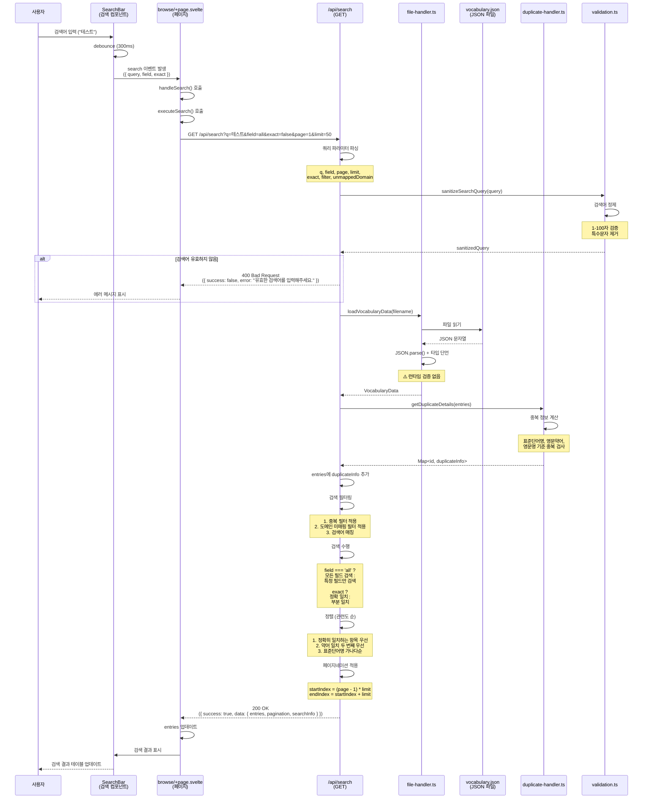

# 단어 검색 (Vocabulary Search) 기능 상세 분석

**마지막 업데이트**: 2024-01-01

---

## 1. 기능 개요

### 목적

사용자가 검색어를 입력하여 단어집을 검색하는 기능입니다. 부분 일치 및 정확 일치 검색을 지원하며, 검색 필드 선택(전체/표준단어명/영문약어/영문명), 중복 필터링, 도메인 미매핑 필터링을 제공합니다.

### 사용자 시나리오

1. **시나리오 1: 기본 검색**
   - 사용자가 검색 바에 "테스트" 입력
   - 검색 필드: "전체" 선택
   - 부분 일치 검색 수행
   - 표준단어명, 영문약어, 영문명 중 하나라도 "테스트"를 포함하는 단어 표시

2. **시나리오 2: 정확 일치 검색**
   - 사용자가 검색어 입력 후 "정확 일치" 옵션 체크
   - 검색어와 완전히 일치하는 단어만 표시

3. **시나리오 3: 검색 필드 선택**
   - 사용자가 검색 필드를 "영문약어"로 선택
   - 영문약어 필드에서만 검색 수행

4. **시나리오 4: 자동완성 제안**
   - 사용자가 검색어 입력 중
   - POST /api/search 호출로 자동완성 제안 표시

---

## 2. 구현 상세

### 관련 파일 전체 목록

#### UI 레이어

- **페이지 컴포넌트**:
  - `src/routes/browse/+page.svelte` (1166줄)
    - `handleSearch()` 함수 (243-251줄)
    - `executeSearch()` 함수 (256-300줄)
    - 검색 상태 관리 (`searchQuery`, `searchField`, `searchExact`)

- **검색 컴포넌트**:
  - `src/lib/components/SearchBar.svelte`
    - 검색어 입력 필드
    - 검색 필드 선택 드롭다운
    - 정확 일치 옵션 체크박스
    - 자동완성 제안 표시

#### API 레이어

- **검색 API 엔드포인트**:
  - `src/routes/api/search/+server.ts` (338줄)
    - `GET` 메소드 (16-245줄): 검색 수행
    - `POST` 메소드 (252-337줄): 검색 제안 (자동완성)

#### DB/유틸리티 레이어

- **파일 핸들러**:
  - `src/lib/utils/file-handler.ts`
    - `loadVocabularyData()` (208-283줄)

- **중복 핸들러**:
  - `src/lib/utils/duplicate-handler.ts`
    - `getDuplicateDetails()` (중복 정보 계산)

- **검증 유틸리티**:
  - `src/lib/utils/validation.ts`
    - `sanitizeSearchQuery()` (검색어 정제)

- **타입 정의**:
  - `src/lib/types/vocabulary.ts`
    - `SearchQuery` 인터페이스
    - `SearchResult` 인터페이스
    - `VocabularyEntry` 인터페이스

### 코드 구조

```
browse/+page.svelte
  ├─ SearchBar 컴포넌트
  │   ├─ 검색어 입력
  │   ├─ 검색 필드 선택
  │   ├─ 정확 일치 옵션
  │   └─ search 이벤트 발생
  │
  ├─ handleSearch() 함수
  │   └─ executeSearch() 호출
  │
  └─ executeSearch() 함수
      ├─ GET /api/search 호출
      └─ 검색 결과 업데이트

/api/search/+server.ts
  ├─ GET 메소드
  │   ├─ 쿼리 파라미터 파싱
  │   ├─ 검색어 정제 (sanitizeSearchQuery)
  │   ├─ loadVocabularyData()
  │   ├─ getDuplicateDetails()
  │   ├─ 검색 필터링
  │   ├─ 정렬 (관련도 순)
  │   ├─ 페이지네이션
  │   └─ 응답 반환
  │
  └─ POST 메소드 (자동완성)
      ├─ 검색어 정제
      ├─ loadVocabularyData()
      ├─ 시작 문자열 매칭
      └─ 제안 목록 반환
```

---

## 3. 데이터 흐름

### 상세 시퀀스 다이어그램



### 각 단계별 사용 타입

| 단계         | 타입/인터페이스              | 파일 위치                     | 설명                      |
| ------------ | ---------------------------- | ----------------------------- | ------------------------- |
| 사용자 입력  | `string`                     | `SearchBar.svelte`            | 검색어 문자열             |
| 검색 이벤트  | `SearchDetail`               | `browse/+page.svelte`         | `{ query, field, exact }` |
| API 요청     | URLSearchParams              | `+server.ts:19-26`            | 쿼리 파라미터             |
| 검색어 정제  | `string`                     | `validation.ts`               | 1-100자 검증된 검색어     |
| 데이터 로드  | `VocabularyData`             | `file-handler.ts:208-283`     | 전체 단어집 데이터        |
| 중복 정보    | `Map<string, DuplicateInfo>` | `duplicate-handler.ts`        | 엔트리별 중복 정보        |
| 검색 필터링  | `VocabularyEntry[]`          | `+server.ts:95-152`           | 필터링된 엔트리 배열      |
| 정렬         | `VocabularyEntry[]`          | `+server.ts:155-176`          | 관련도 순 정렬된 배열     |
| 페이지네이션 | `VocabularyEntry[]`          | `+server.ts:179-181`          | 페이지별 엔트리 배열      |
| API 응답     | `SearchResult`               | `src/lib/types/vocabulary.ts` | 검색 결과 + 메타 정보     |

### 타입 변환 지점

1. **검색어 입력 → SearchDetail**
   - 위치: `SearchBar.svelte`
   - 변환: 문자열 → 객체 (`{ query, field, exact }`)

2. **SearchDetail → URLSearchParams**
   - 위치: `browse/+page.svelte:260-267`
   - 변환: 객체 → URL 쿼리 문자열

3. **검색어 정제**
   - 위치: `validation.ts`
   - 변환: 원본 검색어 → 정제된 검색어 (1-100자, 특수문자 제거)

4. **VocabularyEntry[] → SearchResult**
   - 위치: `+server.ts:196-224`
   - 변환: 필터링된 배열 → 검색 결과 객체 (메타 정보 포함)

---

## 4. 현재 구현 상태

### 작동하는 부분

✅ **정상 작동**:

- 검색어 입력 및 검색 실행
- 검색 필드 선택 (전체/표준단어명/영문약어/영문명)
- 정확 일치 / 부분 일치 검색
- 중복 필터링 (전체/표준단어명/영문약어/영문명)
- 도메인 미매핑 필터링
- 관련도 순 정렬
- 페이지네이션
- 자동완성 제안 (POST /api/search)

### 작동하지 않는 부분

❌ **문제점**:

- 전체 파일을 메모리로 로드하여 성능 문제 (#H7)
- 대용량 데이터에서 검색 속도 저하
- 검색어 정제 로직이 단순함 (특수문자만 제거)
- 검색 결과 캐싱 없음

---

## 5. 발견된 문제점

### 버그

없음 (현재 알려진 버그 없음)

### 개선 필요 사항

1. **전체 파일 메모리 로드 (#H7)**
   - **심각도**: High Priority
   - **위치**: `file-handler.ts:208-283`
   - **문제**: 검색 시 전체 단어집 파일을 메모리로 로드
   - **영향**: 대용량 데이터(10,000개 이상)에서 성능 저하
   - **개선**: 인덱스 파일 또는 스트리밍 처리

2. **검색 성능 최적화 (#L8)**
   - **심각도**: Low Priority
   - **위치**: `+server.ts:95-152`
   - **문제**: 모든 엔트리를 순회하며 필터링
   - **영향**: 대용량 데이터에서 검색 속도 저하
   - **개선**: 인덱스 기반 검색 또는 캐싱

3. **검색어 정제 로직 단순함**
   - **심각도**: Low Priority
   - **위치**: `validation.ts`
   - **문제**: 특수문자만 제거, 한글/영문 정규화 없음
   - **영향**: 검색 정확도 저하 가능성
   - **개선**: 유니코드 정규화, 한글 초성 검색 지원

4. **검색 결과 캐싱 없음**
   - **심각도**: Low Priority
   - **위치**: `+server.ts`
   - **문제**: 동일한 검색어로 반복 검색 시 매번 전체 파일 로드
   - **영향**: 불필요한 I/O 작업
   - **개선**: 검색 결과 캐싱 (TTL 설정)

---

## 6. 개선 제안

### 수정 방향

#### 1. 인덱스 파일 기반 검색

**방향**: 검색 전용 인덱스 파일 생성

```typescript
// src/lib/utils/search-index.ts (신규 생성)
interface SearchIndex {
	standardName: Map<string, string[]>; // 검색어 -> 엔트리 ID 배열
	abbreviation: Map<string, string[]>;
	englishName: Map<string, string[]>;
	lastUpdated: string;
}

export async function buildSearchIndex(entries: VocabularyEntry[]): Promise<SearchIndex> {
	const index: SearchIndex = {
		standardName: new Map(),
		abbreviation: new Map(),
		englishName: new Map(),
		lastUpdated: new Date().toISOString()
	};

	entries.forEach((entry) => {
		// 표준단어명 인덱스
		const standardNameWords = tokenize(entry.standardName);
		standardNameWords.forEach((word) => {
			if (!index.standardName.has(word)) {
				index.standardName.set(word, []);
			}
			index.standardName.get(word)!.push(entry.id);
		});

		// 영문약어 인덱스
		const abbreviationWords = tokenize(entry.abbreviation);
		abbreviationWords.forEach((word) => {
			if (!index.abbreviation.has(word)) {
				index.abbreviation.set(word, []);
			}
			index.abbreviation.get(word)!.push(entry.id);
		});

		// 영문명 인덱스
		const englishNameWords = tokenize(entry.englishName);
		englishNameWords.forEach((word) => {
			if (!index.englishName.has(word)) {
				index.englishName.set(word, []);
			}
			index.englishName.get(word)!.push(entry.id);
		});
	});

	return index;
}

function tokenize(text: string): string[] {
	// 한글: 단어 단위 분리
	// 영문: 단어 단위 분리 (대소문자 무시)
	// 숫자: 그대로 유지
	return text
		.toLowerCase()
		.split(/\s+/)
		.filter((w) => w.length > 0);
}
```

**적용**:

```typescript
// +server.ts
export async function GET({ url }: RequestEvent) {
	// 인덱스 파일 로드 또는 생성
	const indexPath = getIndexPath(filename);
	let searchIndex: SearchIndex;

	if (await exists(indexPath)) {
		searchIndex = await loadSearchIndex(indexPath);
	} else {
		const vocabularyData = await loadVocabularyData(filename);
		searchIndex = await buildSearchIndex(vocabularyData.entries);
		await saveSearchIndex(searchIndex, indexPath);
	}

	// 인덱스 기반 검색
	const matchingIds = searchByIndex(searchIndex, query, field);

	// ID로 엔트리 로드 (필요한 엔트리만)
	const vocabularyData = await loadVocabularyData(filename);
	const matchingEntries = vocabularyData.entries.filter((entry) => matchingIds.includes(entry.id));

	// ... 나머지 로직
}
```

#### 2. 검색 결과 캐싱

**방향**: 검색 결과를 메모리 캐시에 저장

```typescript
// src/lib/utils/search-cache.ts (신규 생성)
import { LRUCache } from 'lru-cache';

const searchCache = new LRUCache<string, SearchResult>({
	max: 100, // 최대 100개 검색 결과 캐싱
	ttl: 5 * 60 * 1000 // 5분 TTL
});

export function getCachedSearchResult(
	query: string,
	field: string,
	exact: boolean,
	page: number,
	limit: number
): SearchResult | undefined {
	const cacheKey = `${query}:${field}:${exact}:${page}:${limit}`;
	return searchCache.get(cacheKey);
}

export function setCachedSearchResult(
	query: string,
	field: string,
	exact: boolean,
	page: number,
	limit: number,
	result: SearchResult
): void {
	const cacheKey = `${query}:${field}:${exact}:${page}:${limit}`;
	searchCache.set(cacheKey, result);
}
```

**적용**:

```typescript
// +server.ts
export async function GET({ url }: RequestEvent) {
	// ... 파라미터 파싱 ...

	// 캐시 확인
	const cached = getCachedSearchResult(sanitizedQuery, field, exact, page, limit);
	if (cached) {
		return json(
			{
				success: true,
				data: cached,
				message: 'Search completed successfully (cached)'
			},
			{ status: 200 }
		);
	}

	// 검색 수행
	const result = await performSearch(/* ... */);

	// 캐시 저장
	setCachedSearchResult(sanitizedQuery, field, exact, page, limit, result);

	return json(
		{
			success: true,
			data: result,
			message: 'Search completed successfully'
		},
		{ status: 200 }
	);
}
```

#### 3. 검색어 정제 개선

**방향**: 유니코드 정규화 및 한글 초성 검색 지원

```typescript
// validation.ts
export function sanitizeSearchQuery(query: string): string | null {
	if (!query || typeof query !== 'string') {
		return null;
	}

	// 1. 길이 검증
	const trimmed = query.trim();
	if (trimmed.length < 1 || trimmed.length > 100) {
		return null;
	}

	// 2. 유니코드 정규화 (NFC)
	const normalized = trimmed.normalize('NFC');

	// 3. 특수문자 제거 (검색에 필요한 문자는 유지)
	const sanitized = normalized.replace(/[^\w\s가-힣]/g, '');

	return sanitized.length > 0 ? sanitized : null;
}

// 한글 초성 검색 지원 (선택적)
export function extractChosung(text: string): string {
	const chosung = [
		'ㄱ',
		'ㄲ',
		'ㄴ',
		'ㄷ',
		'ㄸ',
		'ㄹ',
		'ㅁ',
		'ㅂ',
		'ㅃ',
		'ㅅ',
		'ㅆ',
		'ㅇ',
		'ㅈ',
		'ㅉ',
		'ㅊ',
		'ㅋ',
		'ㅌ',
		'ㅍ',
		'ㅎ'
	];
	return text
		.split('')
		.map((char) => {
			const code = char.charCodeAt(0);
			if (code >= 0xac00 && code <= 0xd7a3) {
				const index = Math.floor((code - 0xac00) / 28 / 21);
				return chosung[index];
			}
			return char;
		})
		.join('');
}
```

### 코드 예시

**개선된 GET 핸들러**:

```typescript
export async function GET({ url }: RequestEvent) {
	try {
		// 1. 쿼리 파라미터 파싱
		const query = url.searchParams.get('q') || '';
		const field = url.searchParams.get('field') || 'all';
		const page = parseInt(url.searchParams.get('page') || '1');
		const limit = parseInt(url.searchParams.get('limit') || '50');
		const exact = url.searchParams.get('exact') === 'true';
		const filename = url.searchParams.get('filename') || undefined;

		// 2. 검색어 정제
		const sanitizedQuery = sanitizeSearchQuery(query);
		if (!sanitizedQuery) {
			return json(
				{
					success: false,
					error: '유효한 검색어를 입력해주세요. (1-100자)',
					message: 'Invalid search query'
				},
				{ status: 400 }
			);
		}

		// 3. 캐시 확인
		const cacheKey = `${sanitizedQuery}:${field}:${exact}:${page}:${limit}:${filename || 'default'}`;
		const cached = searchCache.get(cacheKey);
		if (cached) {
			return json(
				{
					success: true,
					data: cached,
					message: 'Search completed successfully (cached)'
				},
				{ status: 200 }
			);
		}

		// 4. 인덱스 기반 검색 (또는 전체 로드)
		const vocabularyData = await loadVocabularyData(filename);

		// 5. 중복 정보 계산
		const duplicateDetails = getDuplicateDetails(vocabularyData.entries);

		// 6. 검색 수행 (인덱스 사용 시 성능 개선)
		const searchResults = performSearch(
			vocabularyData.entries,
			sanitizedQuery,
			field,
			exact,
			duplicateDetails
		);

		// 7. 정렬 및 페이지네이션
		const sortedResults = sortByRelevance(searchResults, sanitizedQuery);
		const paginatedResults = applyPagination(sortedResults, page, limit);

		// 8. 응답 구성
		const result: SearchResult = {
			entries: paginatedResults,
			totalCount: sortedResults.length,
			query: { query: sanitizedQuery, field: field as SearchQuery['field'] },
			pagination: {
				currentPage: page,
				totalPages: Math.ceil(sortedResults.length / limit),
				totalResults: sortedResults.length,
				limit,
				hasNextPage: page < Math.ceil(sortedResults.length / limit),
				hasPrevPage: page > 1
			}
		};

		// 9. 캐시 저장
		searchCache.set(cacheKey, result);

		return json(
			{
				success: true,
				data: result,
				message: 'Search completed successfully'
			},
			{ status: 200 }
		);
	} catch (error) {
		return handleApiError(error, '검색 처리 중 오류가 발생했습니다.');
	}
}
```

---

## 7. 테스트 시나리오

### 단위 테스트 케이스

#### 1. 검색어 정제 테스트

```typescript
describe('sanitizeSearchQuery', () => {
	it('유효한 검색어 정제 성공', () => {
		expect(sanitizeSearchQuery('테스트')).toBe('테스트');
		expect(sanitizeSearchQuery('  테스트  ')).toBe('테스트');
		expect(sanitizeSearchQuery('Test123')).toBe('Test123');
	});

	it('특수문자 제거', () => {
		expect(sanitizeSearchQuery('테스트!@#')).toBe('테스트');
	});

	it('길이 제한 검증', () => {
		expect(sanitizeSearchQuery('')).toBeNull();
		expect(sanitizeSearchQuery('a'.repeat(101))).toBeNull();
	});
});
```

#### 2. 검색 필터링 테스트

```typescript
describe('GET /api/search - 검색 필터링', () => {
	it('부분 일치 검색 성공', async () => {
		// 테스트 데이터 준비
		await addVocabularyEntry({ standardName: '테스트', abbreviation: 'TEST', englishName: 'Test' });

		const response = await fetch('/api/search?q=테스&field=all&exact=false');
		const result = await response.json();

		expect(result.success).toBe(true);
		expect(result.data.entries.length).toBeGreaterThan(0);
		expect(result.data.entries[0].standardName).toContain('테스트');
	});

	it('정확 일치 검색 성공', async () => {
		const response = await fetch('/api/search?q=테스트&field=standardName&exact=true');
		const result = await response.json();

		expect(result.success).toBe(true);
		result.data.entries.forEach((entry) => {
			expect(entry.standardName).toBe('테스트');
		});
	});

	it('검색 필드 선택 동작 확인', async () => {
		const response = await fetch('/api/search?q=TEST&field=abbreviation');
		const result = await response.json();

		expect(result.success).toBe(true);
		result.data.entries.forEach((entry) => {
			expect(entry.abbreviation.toLowerCase()).toContain('test');
		});
	});
});
```

#### 3. 페이지네이션 테스트

```typescript
describe('GET /api/search - 페이지네이션', () => {
	it('페이지네이션 정상 동작', async () => {
		// 100개 이상의 테스트 데이터 생성
		for (let i = 0; i < 150; i++) {
			await addVocabularyEntry({
				standardName: `테스트${i}`,
				abbreviation: `TEST${i}`,
				englishName: `Test${i}`
			});
		}

		const response = await fetch('/api/search?q=테스트&page=1&limit=50');
		const result = await response.json();

		expect(result.success).toBe(true);
		expect(result.data.entries.length).toBe(50);
		expect(result.data.pagination.currentPage).toBe(1);
		expect(result.data.pagination.totalPages).toBeGreaterThan(1);
		expect(result.data.pagination.hasNextPage).toBe(true);
	});
});
```

### 통합 테스트 시나리오

#### 1. 전체 검색 플로우 테스트

```typescript
describe('검색 통합 테스트', () => {
	it('사용자가 검색하면 결과가 표시됨', async () => {
		// 1. 페이지 로드
		await page.goto('/browse');

		// 2. 검색어 입력
		await page.fill('input[placeholder*="검색"]', '테스트');

		// 3. 검색 실행
		await page.click('button:has-text("검색")');

		// 4. 검색 결과 확인
		await expect(page.locator('td:has-text("테스트")')).toBeVisible();
	});

	it('자동완성 제안 표시', async () => {
		await page.goto('/browse');

		// 검색어 입력 중
		await page.fill('input[placeholder*="검색"]', '테');

		// 자동완성 제안 확인
		await expect(page.locator('.suggestion-list')).toBeVisible();
		await expect(page.locator('.suggestion-item')).toHaveCount(10);
	});
});
```

#### 2. 성능 테스트

```typescript
describe('검색 성능 테스트', () => {
	it('대용량 데이터에서 검색 성능 측정', async () => {
		// 10,000개 데이터 생성
		const entries = Array.from({ length: 10000 }, (_, i) => ({
			standardName: `테스트${i}`,
			abbreviation: `TEST${i}`,
			englishName: `Test${i}`
		}));

		await bulkAddVocabularyEntries(entries);

		// 성능 측정
		const startTime = Date.now();
		const response = await fetch('/api/search?q=테스트&limit=50');
		const endTime = Date.now();

		const result = await response.json();
		expect(result.success).toBe(true);

		// 1초 이내 응답 확인
		expect(endTime - startTime).toBeLessThan(1000);
	});
});
```

---

**마지막 업데이트**: 2024-01-01
